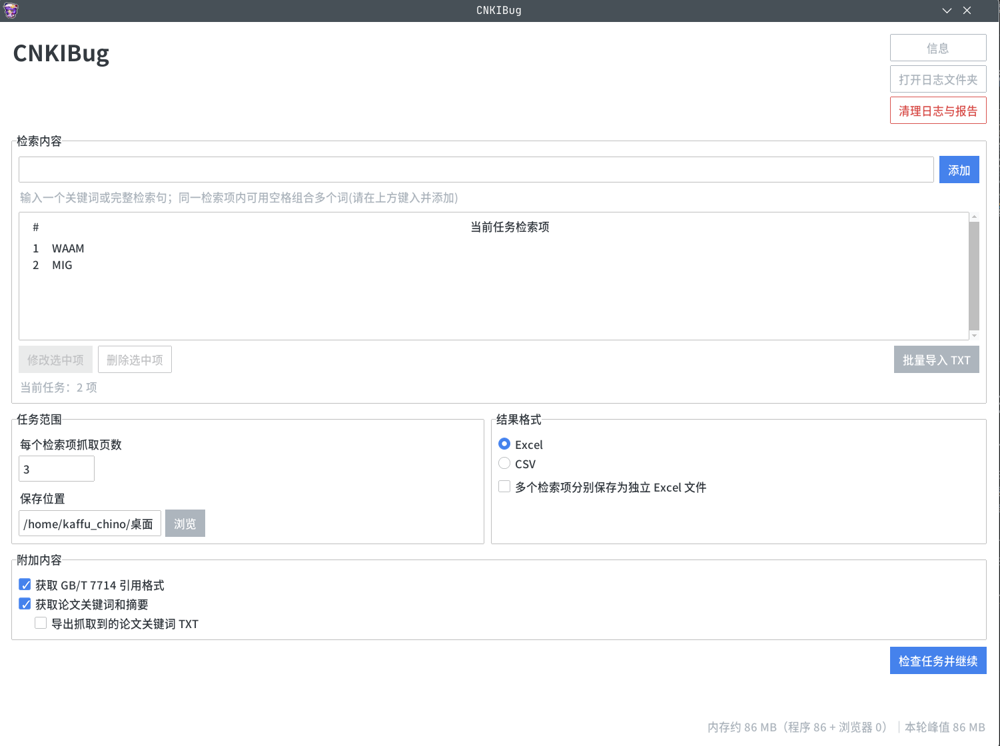
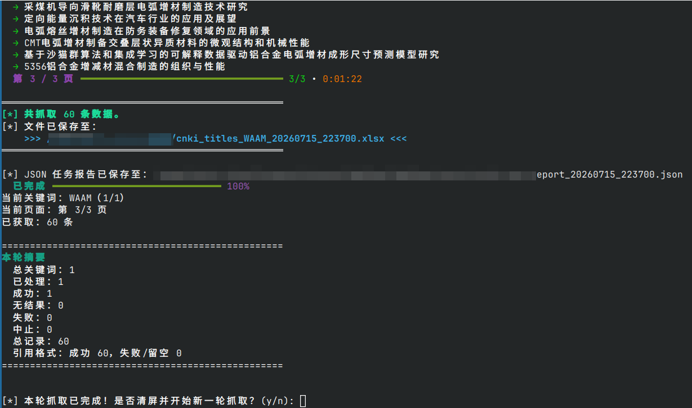
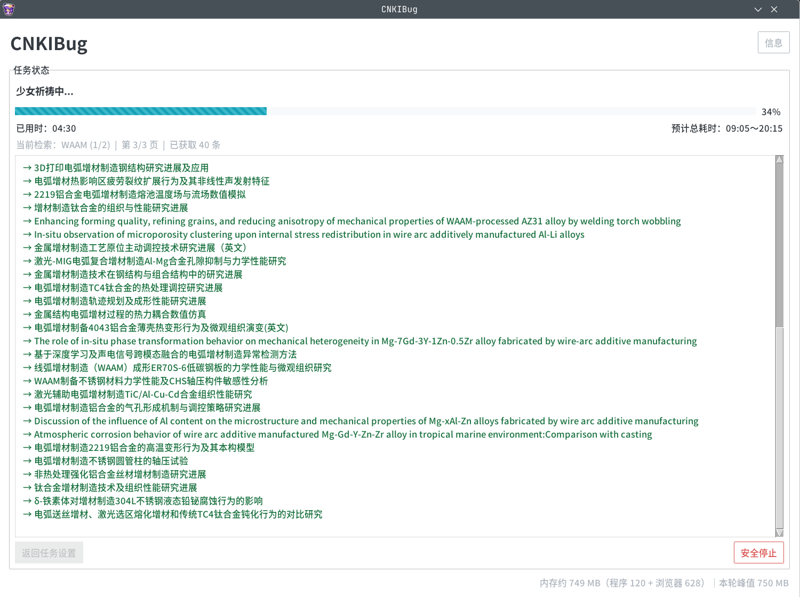

# CNKIBug 

> 中国知网（CNKI）论文标题批量爬取工具。Windows 下可打包为独立 `.exe` 开箱即用，无需安装任何环境；Linux / macOS 可通过源码运行。


---

##  功能特性

-  输入关键词，自动批量抓取知网论文标题，支持多关键词抓取模式
-  结果自动导出为 `.xlsx` Excel 文件，保存至桌面，用户可以选择多关键词保存策略
-  优先调用系统自带的 **Microsoft Edge**（Windows）；找不到时自动回退到 Playwright 的 Chromium，故 Linux / macOS 亦可运行
-  完善的错误提示，缺少环境时弹出友好的引导窗口
-  抓取中途按 `Ctrl+C` 或关闭浏览器可安全中止，已抓取数据不丢失
-  可打包为单文件 `.exe`，双击即用，无需 Python 环境

---

##  运行截图 

<table style="border: none;">
  <tr>
    <td style="text-align: center; vertical-align: top; width: 50%;">
      
      <br /><sub><b>启动演示1</b></sub>
    </td>
    <td style="text-align: center; vertical-align: top; width: 50%;">
      
      <br /><sub><b>2.输入关键词与设置</b></sub>
    </td>
  </tr>
  <tr>
    <td style="text-align: center; vertical-align: top; width: 50%;">
      
      <br /><sub><b>3. 抓取完成</b></sub>
    </td>
    <td style="text-align: center; vertical-align: top; width: 50%;">
      
      <br /><sub><b>4. 抓取完成，结果保存至桌面</b></sub>
    </td>
  </tr>
</table>


---


##  快速开始


### 方式一：直接运行（推荐）

1. 前往 [Releases](../../releases) 页面下载最新的 `CNKIBug.exe`
2. 确保电脑已安装 **Microsoft Edge**（Win10/11 通常已预装）
3. 双击 `CNKIBug.exe`，按提示输入关键词和页数即可
4. 请注意：**一定要手动通过知网的滑块人机验证**

> 如提示未找到 Edge，请访问 https://www.microsoft.com/zh-cn/edge/download 下载安装。

### 方式二：源码运行（Linux / macOS 用户，或开发者）

> Windows 用户建议直接用方式一的 `.exe`；**Linux / macOS 用户请使用本方式**。

```bash
# 1. 安装依赖（pywin32 已标记为仅 Windows 安装，Linux / macOS 会自动跳过）
pip install -r requirements.txt
# 或手动：pip install playwright openpyxl rich

# 2. 安装浏览器内核
playwright install chromium

# 3. 从仓库根目录运行入口脚本
python run.py
```

> ⚠️ **必须有图形桌面**（X11 / Wayland）：知网会弹出滑块验证，需要人工手动通过，
> 因此**无法在纯无头（headless）服务器上运行**。
> 结果 `.xlsx` 保存到当前用户桌面目录（中文桌面会正确识别为 `~/桌面`）。

### 方式三：自行打包为 exe

```bash
pip install pyinstaller
# 入口为 run.py，PyInstaller 会自动跟随 import 把整个 cnkibug/ 包收进单 exe
pyinstaller --onefile --console --name CNKIBug run.py
# 生成文件在 dist/CNKIBug.exe
```

---

## 系统要求

| 项目 | 要求 |
|------|------|
| 操作系统 | Windows 10 / 11；或带图形桌面的 Linux / macOS（源码运行） |
| 浏览器 | Windows：Microsoft Edge（预装或手动安装）；Linux / macOS：`playwright install chromium` 的 Chromium |
| Python | 3.10+（源码运行需要） |
| 图形界面 | 必需 —— 需人工通过知网滑块验证，无法在纯无头服务器运行 |

---

##  项目结构

```
CNKIBug/
├── run.py                  # 程序入口（PyInstaller 打包入口、依赖守卫、主菜单循环）
├── cnkibug/                # 核心包
│   ├── __init__.py
│   ├── errors.py           # 错误弹窗（仅依赖标准库）
│   ├── ui.py               # 共享的 rich Console 单例
│   ├── environment.py      # 平台/环境检测（Edge 检查、桌面路径）
│   ├── exporter.py         # 结果导出（xlsx、文件名清洗、三种保存模式）
│   ├── estimate.py         # 抓取耗时估算
│   ├── window.py           # 浏览器窗口置顶（主要用于验证码提示）
│   └── scraper.py          # 核心抓取与多关键词编排
├── requirements.txt        # 依赖清单（playwright / openpyxl / rich）
├── icon.ico                # 打包图标
├── version.txt             # exe 版本信息
├── README.md
├── .github/
│   └── workflows/
│       └── build.yml       # CI：在 Windows 上构建并发布 exe
└── dist/
    └── CNKIBug.exe         # 打包产物（不纳入版本管理）
```

> 0.1.6 起代码由单文件重构为上述多文件包结构，行为保持不变；打包入口随之由
> `CNKIBug.py` 改为 `run.py`。

---

##  版本规划
**0.1.x阶段：**
- [x] 1.无限续杯:当前检索并保存完毕后，程序直接结束，需重新双击运行才能进行下一次检索 
- [x] 2.强退防丢:用户检索中途（如手抖填了200页）想终止，直接点浏览器红叉或按 Ctrl+C 会导致程序崩溃，已抓取数据全部丢失
- [x] 3.超大页数拦截警告
- [x] 4.首页重定向修复:首次启动无 Cookie 时，知网大概率会重定向到科普/低质文章推荐页，导致检索目标错误

**0.2.x阶段：**

- [ ] 6.复合关键词查询:高级检索页面?解析用户输入的逻辑符（空格、+、AND），自动在知网基础搜索框触发复合检索?(未定)

**0.3.x阶段：**

- [ ] 7.参考文献/引证文献抓取(耗时、技术难度大大增加)（考虑中）
- [ ] 8.SCI (Web of Science) 与校园 WebVPN 支持(拒绝)
- [ ] 9.Web UI界面


---

##  免责声明

本工具仅供个人学习、代码研究与非商业用途使用。请严格遵守知网（CNKI）的用户协议及相关法律法规。高频爬取极易触发 IP 封禁与验证码，请合理设置抓取页数，切勿滥用。

---

##  作者

**Kaffu_Alcaid** — 非科班出身的业余开发者，全凭兴趣写码。欢迎提交Issue探讨或发起PR！

---
## ♥️ 致谢 / Contributors

<table style="border: none;">
  <tr>
    <td style="text-align: center; vertical-align: top; width: 200px;">
      <a href="https://github.com/KaffuAlcaid">
        
        <br /><sub><b>Kaffu_Alcaid</b></sub>
      </a><br />核心开发
    </td>
    <td style="text-align: center; vertical-align: top; width: 200px;">
      <a href="https://github.com/Speechlessyc">
        
        <br /><sub><b>Speechlessyc</b></sub>
      </a><br />图标设计 & 测试
    </td>
    <td style="text-align: center; vertical-align: top; width: 200px;">
      <a href="https://github.com/cloudw233">
        
        <br /><sub><b>cloudw233</b></sub>
      </a><br />自动化构建(CI/CD)
    </td>
  </tr>
  <tr>
     <td style="text-align: center; vertical-align: top; width: 200px;">
      <a href="https://github.com/zirend666-prog">
        
        <br /><sub><b>zirend666-prog</b></sub>
      </a><br />产品经理
    </td>
    <td style="text-align: center; vertical-align: top; width: 200px;">
      <a href="https://github.com/LuisCotton">
        
        <br /><sub><b>LuisCotton</b></sub>
      </a><br />特约吉祥物
    </td>
    <td style="text-align: center; vertical-align: top; width: 200px;">
      <a href="https://github.com/clover1909">
        
        <br /><sub><b>clover1909</b></sub>
      </a><br />可爱群友
    </td>
  </tr>
  <tr>
    <td style="text-align: center; vertical-align: top; width: 200px;">
      
      <br /><sub><b>虚位以待</b></sub>
      <br />欢迎提交 PR
    </td>
    <td style="text-align: center; vertical-align: top; width: 200px;">
      
      <br /><sub><b>虚位以待</b></sub>
      <br />欢迎提交 PR
    </td>
    <td style="text-align: center; vertical-align: top; width: 200px;">
      
      <br /><sub><b>虚位以待</b></sub>
      <br />欢迎提交 PR
    </td>
  </tr>
  <tr>
    <td style="text-align: center; vertical-align: top; width: 200px;">
      
      <br /><sub><b>虚位以待</b></sub>
      <br />欢迎提交 PR
    </td>
      <td style="text-align: center; vertical-align: top; width: 200px;">
      <a href="https://claude.ai">
        
        <br /><sub><b>Claude</b></sub>
      </a><br /> 代码改进
    </td>
    <td style="text-align: center; vertical-align: top; width: 200px;">
      <a href="https://gemini.google.com/">
        
        <br />
        <sub><b>Gemini</b></sub>
      </a>
      <br />
      代码审查<br/>
    </td>
  </tr>
</table>
