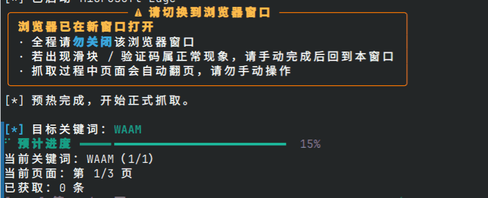

# CNKIBug 

> 中国知网（CNKI）论文标题批量爬取工具。Windows 下可打包为独立 `.exe` 开箱即用，无需安装任何环境；Linux / macOS 可通过源码运行。


---

##  功能特性

-  输入关键词或从 UTF-8 TXT 文件批量导入，自动去重并在执行前预览任务规模和预计耗时
-  结果可导出为 `.xlsx` Excel 文件或带 `keyword` 列的单文件 `.csv`，Excel 中包含可点击的 CNKI 详情链接
-  可选抓取 GB/T 7714 引文；逐篇获取会明显增加耗时，默认关闭
-  优先调用系统自带的 **Microsoft Edge**（Windows）；找不到时自动回退到 Playwright 的 Chromium，故 Linux / macOS 亦可运行
-  自动保存配置、会话缓存、日志和任务报告
-  支持复用 `CNKIBug/cache/cookies` 中的浏览器会话状态，默认 12 小时有效，可降低重复验证码概率
-  抓取过程记录关键行为日志，结束时输出任务摘要，并生成包含失败原因和字段完整性统计的 JSON 报告
-  抓取中途按 `Ctrl+C` 或关闭浏览器可安全中止，并从最近完成页继续

---

##  运行截图 

<table style="border: none;">
  <tr>
    <td style="text-align: center; vertical-align: top; width: 50%;">
      
      <br /><sub><b>输入关键词与设置</b></sub>
    </td>
    <td style="text-align: center; vertical-align: top; width: 50%;">
      
      <br /><sub><b>抓取过程</b></sub>
    </td>
  </tr>
  <tr>
    <td style="text-align: center; vertical-align: top; width: 50%;">
      
      <br /><sub><b>抓取完成</b></sub>
    </td>
    <td style="text-align: center; vertical-align: top; width: 50%;">
      
      <br /><sub><b>结果展示</b></sub>
    </td>
  </tr>
</table>


---


##  快速开始


### 方式一：直接运行（推荐）

1. 前往 [Releases](../../releases) 页面下载最新的 `CNKIBug.exe`
2. 确保电脑已安装 **Microsoft Edge**（Win10/11 通常已预装）
3. 双击 `CNKIBug.exe`，按提示手动输入关键词，或在多关键词模式中导入 TXT 文件
4. 请注意：**一定要手动通过知网的滑块人机验证**

首次运行后，打包版会在 `CNKIBug.exe` 同目录创建 `CNKIBug/` 运行数据目录，源码版则固定创建在 `run.py` 同目录。目标目录不可写时程序会明确报错，不会改存到其他位置。`config.json` 可调整超时、日志和会话缓存参数；`cache/cookies` 保存浏览器会话状态，默认 12 小时后过期并重建；`log/` 保存运行日志；`status/` 保存 JSON 任务报告

> 如提示未找到 Edge，请访问 https://www.microsoft.com/zh-cn/edge/download 下载安装

### 批量导入与输出

TXT 导入仅用于多关键词模式，文件必须使用 UTF-8 编码，每个非空行表示一个独立关键词。程序会去除行首、行尾空白，忽略空行，并按首次出现顺序精确去重；关键词内部空格会保留。单个文件不能超过 1 MiB，去重后最多 1000 个关键词

所有任务在启动浏览器前都会显示关键词、页数、保存方式、引文设置和预计耗时，并可返回重新设置。知网每页通常约 20 条结果，例如抓取约 100 条可填写 5 页；预计耗时上限超过 10 分钟时会显示风险提示。批量导入还会显示读取行数、空行数、重复数、最终关键词数和理论最多页数，所有关键词共用同一个抓取页数、保存方式和引文设置

单关键词任务可以选择 Excel 或 CSV；多关键词任务支持每个关键词一个 Excel、单个 Excel 多 Sheet 或单个 CSV。开启引文后，结果列为“论文标题、作者、来源、发表日期、引用格式、详情链接”；程序会移除 GB/T 引文开头的 `[1]`，保留 `[J]`、`[D]` 等文献类型标记，单条引文获取失败时留空并继续。CSV 使用 UTF-8 BOM 编码，并在开启引文时于 `publication_date` 和 `detail_url` 之间增加 `citation` 列

每轮任务还会在 `CNKIBug/status/` 中生成 `cnki_task_report_时间戳.json`，记录所有关键词的执行状态、失败原因、记录数、字段缺失和引文获取统计。报告不包含完整论文记录；中止时尚未执行的关键词标记为 `not_started`

### 方式二：源码运行（Linux / macOS 用户，或开发者）

> Windows 用户建议直接用方式一的 `.exe`；**Linux / macOS 用户请使用本方式**

```bash
pip install -r requirements.txt
playwright install chromium
python run.py
```

> **必须有图形桌面**（X11 / Wayland）：知网会弹出滑块验证，需要人工手动通过
> 因此**无法在纯无头（headless）服务器上运行**
> 结果文件保存到当前用户桌面目录（中文桌面会正确识别为 `~/桌面`）

### 方式三：自行打包为 exe

```bash
pip install -e . -r requirements-build.txt
python generate_version_info.py version.txt
pyinstaller --onefile --console --version-file=version.txt --copy-metadata cnkibug --name CNKIBug run.py
```

生成文件位于 `dist/CNKIBug.exe`

---

## 配置文件说明

首次运行后，程序会在运行目录旁创建：

```text
CNKIBug/config.json
```

修改配置后请重新启动程序。`config.json` 是标准 JSON 文件，不支持 `//` 或 `#` 注释

```json
{
  "version": 1,
  "timeout_goto_ms": 30000,
  "timeout_load_ms": 20000,
  "timeout_selector_ms": 15000,
  "verify_wait_timeout_sec": 180,
  "verify_notice_interval_sec": 15,
  "max_advance_fail": 2,
  "session_cache_enabled": true,
  "session_cache_ttl_hours": 12,
  "log_level": "INFO",
  "log_save_path": true,
  "log_keywords": false,
  "log_scraped_records": false
}
```

| 参数                           | 默认值      | 可填值                                | 作用                                   |
|------------------------------|----------|------------------------------------|--------------------------------------|
| `version`                    | `1`      | 正整数                                | 配置文件版本号，不建议手动修改                      |
| `timeout_goto_ms`            | `30000`  | 正整数，毫秒                             | 打开 CNKI 页面时的最长等待时间                   |
| `timeout_load_ms`            | `20000`  | 正整数，毫秒                             | 等待页面加载的最长时间                          |
| `timeout_selector_ms`        | `15000`  | 正整数，毫秒                             | 等待搜索框、结果表格、翻页按钮等元素的最长时间              |
| `verify_wait_timeout_sec`    | `180`    | 正整数，秒                              | 等待用户完成滑块或安全验证的最长时间                   |
| `verify_notice_interval_sec` | `15`     | 正整数，秒                              | 验证等待期间的提醒间隔                          |
| `max_advance_fail`           | `2`      | 正整数                                | 连续翻页失败多少次后结束当前关键词                    |
| `session_cache_enabled`      | `true`   | `true` / `false`                   | 是否复用 `CNKIBug/cache/cookies` 中的浏览器会话 |
| `session_cache_ttl_hours`    | `12`     | 正整数，小时                             | Cookie 会话缓存的有效期                      |
| `log_level`                  | `"INFO"` | `"INFO"` / `"WARNING"` / `"ERROR"` | 日志级别                                 |
| `log_save_path`              | `true`   | `true` / `false`                   | 是否在日志中记录导出文件路径                       |
| `log_keywords`               | `false`  | `true` / `false`                   | 是否在日志中记录关键词                          |
| `log_scraped_records`        | `false`  | `true` / `false`                   | 是否记录详细的抓取统计                          |

### 常见调整

- 网络慢：把 `timeout_goto_ms`、`timeout_load_ms`、`timeout_selector_ms` 适当调大
- 验证码来不及处理：把 `verify_wait_timeout_sec` 调大
- 会话状态异常：删除 `CNKIBug/cache/cookies`，或把 `session_cache_enabled` 改为 `false` 后重启
- 不想日志记录本机路径：把 `log_save_path` 改为 `false`

---

## 系统要求

| 项目     | 要求                                                                                      |
|--------|-----------------------------------------------------------------------------------------|
| 操作系统   | Windows 10 / 11；或带图形桌面的 Linux / macOS（源码运行）                                             |
| 浏览器    | Windows：Microsoft Edge（已预装或手动安装）；Linux / macOS：`playwright install chromium` 的 Chromium |
| Python | 3.10–3.13（源码运行需要）                                                                       |
| 图形界面   | 必需 —— 需人工通过知网滑块验证，无法在纯无头服务器运行                                                           |

---

## 不支持范围

CNKIBug 仅面向中国知网（CNKI）基础检索结果标题抓取，不支持 Web of Science / SCI 数据库，也不支持通过校园 WebVPN、统一认证网关或代管账号密码的方式抓取机构资源。

遇到这类访问环境时，请改用浏览器手动访问对应平台。

---

##  项目结构

```
CNKIBug/
├── run.py                  # 程序入口
├── cnkibug/
│   ├── __init__.py         # Python 包入口
│   ├── app/                # 菜单、配置、运行环境和控制台界面
│   │   ├── cli.py          # 主菜单与任务循环
│   │   ├── console.py      # 控制台输入与清屏
│   │   ├── environment.py  # 运行环境检查
│   │   ├── errors.py       # 致命错误提示
│   │   ├── events.py       # 控制台事件适配
│   │   ├── prompts.py      # 抓取参数输入与任务预览
│   │   ├── report_view.py  # 任务报告展示
│   │   ├── runtime.py      # 运行目录、配置和日志
│   │   └── ui.py           # Rich 进度显示
│   ├── browser/            # 浏览器生命周期与会话缓存
│   │   ├── cache.py        # cookies 缓存
│   │   ├── runtime.py      # 浏览器启动与上下文
│   │   └── session.py      # 单轮抓取状态
│   ├── cnki/               # CNKI 页面操作与单关键词抓取
│   │   ├── citation.py     # GB/T 引文获取
│   │   ├── guard.py        # 安全验证检测
│   │   ├── keyword.py      # 单关键词流程
│   │   ├── metrics.py      # 页面抓取指标
│   │   ├── models.py       # 抓取结果模型
│   │   ├── pages.py        # 当前页处理与翻页状态
│   │   ├── pagination.py   # 页码与页面变化判断
│   │   ├── results.py      # 结果解析
│   │   ├── resume.py       # 页级断点定位
│   │   ├── search.py       # 搜索与预热
│   │   └── selectors.py    # 页面选择器
│   ├── core/               # 界面无关的核心模型与接口
│   │   ├── estimate.py     # 抓取耗时估算
│   │   ├── events.py       # 任务事件接口
│   │   ├── runtime.py      # 运行路径模型
│   │   ├── settings.py     # 抓取配置模型
│   │   └── version.py      # 应用版本读取
│   ├── fileio/             # 文件输入输出
│   │   ├── exporter.py     # XLSX/CSV 导出
│   │   ├── keyword_input.py # TXT 关键词导入
│   │   └── paths.py        # 输出目录定位
│   └── workflow/           # 多关键词任务编排与收尾
│       ├── finalize.py     # 保存、报告和浏览器关闭
│       ├── keyword_run.py  # 单个关键词的任务级执行
│       ├── report.py       # 任务报告数据
│       ├── runner.py       # 总任务入口
│       ├── state.py        # 断点状态
│       └── task.py         # 任务上下文与初始化
├── CNKIBug/                # 运行时数据目录
│   ├── config.json         # 用户配置
│   ├── cache/              # 会话与断点缓存
│   ├── log/                # 运行日志
│   └── status/             # JSON 任务报告
├── tests/
├── pyproject.toml
├── README.md
└── .github/workflows/
```

### 测试目录结构

```
tests/
├── fixtures/
│   ├── cnki_no_results.html  # 无结果页面样本
│   ├── cnki_results.html     # 搜索结果页面样本
│   └── verify/               # 安全验证页面样本
├── test_architecture.py       # 分层依赖约束测试
├── test_browser_runtime.py    # 浏览器启动测试
├── test_cnki_page.py          # 页面选择器测试
├── test_cnki_pagination.py    # 结果翻页测试
├── test_cnki_records.py       # 结果解析测试
├── test_citation_fetcher.py   # GB/T 引文获取测试
├── test_dom_contract.py       # CNKI DOM 结构契约测试
├── test_estimate.py           # 耗时估算测试
├── test_exporter.py           # 结果导出测试
├── test_keyword_import.py     # 关键词导入测试
├── test_keyword_scraper.py    # 单关键词抓取测试
├── test_prompts.py            # 参数输入测试
├── test_run.py                # 程序入口测试
├── test_runtime.py            # 运行目录与配置测试
├── test_scrape_report.py      # 任务报告测试
├── test_scrape_workflow.py    # 抓取编排测试
├── test_session_cache.py      # 会话缓存测试
├── test_settings.py           # 抓取配置测试
├── test_task_state.py         # 断点状态测试
├── test_ui.py                 # Rich 预计进度展示测试
└── test_version.py            # 版本读取测试
```

---

## 免责声明

CNKIBug 是独立开发的开源工具，与中国知网（CNKI）及其关联方不存在隶属、授权、合作或背书关系。

本软件仅提供自动化操作能力。使用者应确保其访问和使用行为符合所在国家和地区合法的适用的法律法规、CNKI 用户协议及所在机构的相关规定，并自行确认对相关内容访问和处理权限。

请合理控制任务规模和访问频率，本项目不以绕过任何网站的技术或商业限制为目的，不鼓励或支持任何违反服务协议或适用法律法规的使用方式。

本软件按“现状”提供，不保证 CNKI 页面长期兼容，也不保证结果完整、准确或持续可用。

因网络异常、网站变更、验证码、账号或 IP 限制、数据处理及使用本软件产生的风险，由使用者依法承担；作者在所在国家和地区合法的适用法律允许的范围内不承担相关责任。

本免责声明作为项目文档的一部分，与仓库中的 MIT License 共同适用于本项目；如两者存在冲突，以适用法律规定为准。

软件会在本地保存配置、日志、任务状态和浏览器会话信息。请妥善保管运行数据目录，并在分享日志或任务报告前检查其中是否包含敏感信息。

本软件不会主动修改、去除或规避内容版权标识，也不会授予用户访问任何受版权保护内容的权利。

用户应自行妥善保管账号凭据，不建议在非受信任环境运行本软件。

下载并使用本软件，视作您同意本免责声明和 MIT License。

---
## 致谢 / Contributors

<table style="border: none;">
  <tr>
    <td style="text-align: center; vertical-align: top; width: 200px;">
      <a href="https://github.com/KaffuAlcaid">
        
        <br /><sub><b>Kaffu_Alcaid</b></sub>
      </a><br />核心开发
    </td>
    <td style="text-align: center; vertical-align: top; width: 200px;">
      <a href="https://github.com/Speechlessyc">
        
        <br /><sub><b>Speechlessyc</b></sub>
      </a><br />图标设计 & 测试
    </td>
    <td style="text-align: center; vertical-align: top; width: 200px;">
      <a href="https://github.com/cloudw233">
        
        <br /><sub><b>cloudw233</b></sub>
      </a><br />自动化构建(CI/CD)
    </td>
  </tr>
  <tr>
     <td style="text-align: center; vertical-align: top; width: 200px;">
      <a href="https://github.com/zirend666-prog">
        
        <br /><sub><b>zirend666-prog</b></sub>
      </a><br />产品经理
    </td>
    <td style="text-align: center; vertical-align: top; width: 200px;">
      <a href="https://github.com/LuisCotton">
        
        <br /><sub><b>LuisCotton</b></sub>
      </a><br />特约吉祥物
    </td>
    <td style="text-align: center; vertical-align: top; width: 200px;">
      <a href="https://github.com/clover1909">
        
        <br /><sub><b>clover1909</b></sub>
      </a><br />可爱群友
    </td>
  </tr>
  <tr>
    <td style="text-align: center; vertical-align: top; width: 200px;">
      
      <br /><sub><b>虚位以待</b></sub>
      <br />欢迎提交 PR
    </td>
    <td style="text-align: center; vertical-align: top; width: 200px;">
      
      <br /><sub><b>虚位以待</b></sub>
      <br />欢迎提交 PR
    </td>
    <td style="text-align: center; vertical-align: top; width: 200px;">
      
      <br /><sub><b>虚位以待</b></sub>
      <br />欢迎提交 PR
    </td>
  </tr>
  <tr>
    <td style="text-align: center; vertical-align: top; width: 200px;">
      <a href="https://openai.com/codex/">
        
        <br /><sub><b>ChatGPT / Codex</b></sub>
      </a><br />代码改进
    </td>
      <td style="text-align: center; vertical-align: top; width: 200px;">
      <a href="https://claude.ai">
        
        <br /><sub><b>Claude</b></sub>
      </a><br /> 代码改进
    </td>
    <td style="text-align: center; vertical-align: top; width: 200px;">
      <a href="https://gemini.google.com/">
        
        <br />
        <sub><b>Gemini</b></sub>
      </a>
      <br />
      代码审查<br/>
    </td>
  </tr>
</table>
