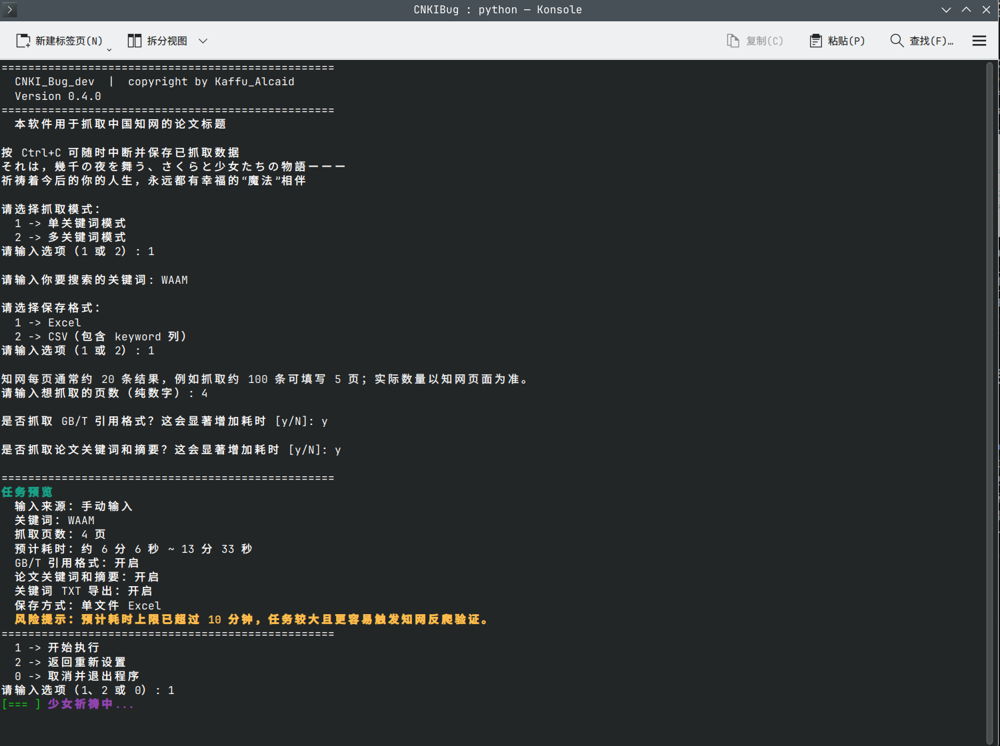

# CNKIBug 

> 中国知网（CNKI）论文标题批量爬取工具，支持直接打包为 Windows 独立 `.exe`，无需用户安装任何环境。


---

##  功能特性

-  输入关键词，自动批量抓取知网论文标题，支持多关键词抓取模式
-  结果自动导出为 `.xlsx` Excel 文件，保存至桌面，用户可以选择多关键词保存策略
-  优先调用系统自带的 **Microsoft Edge**，无需额外安装浏览器驱动
-  完善的错误提示，缺少环境时弹出友好的引导窗口
-  可打包为单文件 `.exe`，双击即用，无需 Python 环境

---

##  运行截图 

<table border="0">
  <tr>
    <td align="center" width="50%">
      
      <br /><sub><b>启动演示1</b></sub>
    </td>
    <td align="center" width="50%">
      
      <br /><sub><b>2.输入关键词与设置</b></sub>
    </td>
  </tr>
  <tr>
    <td align="center" width="50%">
      
      <br /><sub><b>3. 抓取完成</b></sub>
    </td>
    <td align="center" width="50%">
      
      <br /><sub><b>4. 抓取完成，结果保存至桌面</b></sub>
    </td>
  </tr>
</table>
---
##  快速开始

### 方式一：直接运行（推荐普通用户）

1. 前往 [Releases](../../releases) 页面下载最新的 `CNKIBug.exe`
2. 确保电脑已安装 **Microsoft Edge**（Win10/11 通常已预装）
3. 双击 `CNKIBug.exe`，按提示输入关键词和页数即可
4. 请注意：**一定要手动通过知网的滑块人机验证**

> 如提示未找到 Edge，请访问 https://www.microsoft.com/zh-cn/edge/download 下载安装。

### 方式二：源码运行（开发者）

```bash
# 1. 安装依赖
pip install playwright openpyxl rich

# 2. 安装浏览器驱动（开发环境需要）
playwright install chromium

# 3. 运行
python CNKIBug.py
```

### 方式三：自行打包为 exe

```bash
pip install pyinstaller
pyinstaller --onefile --console --name CNKIBug CNKIBug_v0.0.6.py
# 生成文件在 dist/CNKIBug.exe
```

---

## 系统要求

| 项目 | 要求 |
|------|------|
| 操作系统 | Windows 10 / 11 |
| 浏览器 | Microsoft Edge（预装或手动安装） |
| Python | 3.10+（仅源码运行需要） |

---

##  项目结构

```
CNKIBug/
├── CNKIBug_vxxxx.py   # 主程序（当前版本）
├── README.md
└── dist/
    └── CNKIBug.exe        # 打包产物（不纳入版本管理）
```

---

##  版本规划
0.1.x阶段：
[]1 .无限续杯:当前检索并保存完毕后，程序直接结束，需重新双击运行才能进行下一次检索
[]2. 强退防丢:用户检索中途（如手抖填了200页）想终止，直接点浏览器红叉或按 Ctrl+C 会导致程序崩溃，已抓取数据全部丢失
[]3.超大页数拦截警告
[]4.首页重定向修复:首次启动无 Cookie 时，知网大概率会重定向到科普/低质文章推荐页，导致检索目标错误
0.2.x阶段：
[]5. 复合关键词查询:高级检索页面?解析用户输入的逻辑符（空格、+、AND），自动在知网基础搜索框触发复合检索?(未定)
[]6.没想好
0.3.x阶段：
[]7. 参考文献/引证文献抓取(耗时、技术难度大大增加)（考虑中）
[]8.SCI (Web of Science) 与校园 WebVPN 支持(拒绝)
[]9.Web UI界面


---

##  免责声明

本工具仅供学习与研究使用，请遵守知网用户协议及相关法律法规。爬取频率过高可能触发验证码，请合理设置页数。

---

##  作者

**Kaffu_Alcaid** — 非计算机专业，业余开发，欢迎 Issue 和 PR。

---
## 🌟 致谢 / Contributors

<table>
  <tr>
    <td align="center" width="200px">
      <a href="https://github.com/KaffuAlcaid">
        
        <br /><sub><b>Kaffu_Alcaid</b></sub>
      </a><br />核心开发
    </td>
    <td align="center" width="200px">
      <a href="https://github.com/Speechlessyc">
        
        <br /><sub><b>Speechlessyc</b></sub>
      </a><br />图标设计 & 测试
    </td>
    <td align="center" width="200px">
      <a href="https://github.com/cloudw233">
        
        <br /><sub><b>cloudw233</b></sub>
      </a><br />自动化构建(CI/CD)
    </td>
  </tr>
  <tr>
    <td align="center" width="200px">
      <a href="https://github.com/claude">
        
        <br /><sub><b>Claude</b></sub>
      </a><br />文档润色 & 代码改进
    </td>
    <td align="center">
      <a href="https://gemini.google.com/">
        
        <br />
        <sub><b>Gemini</b></sub>
      </a>
      <br />
      结对编程 & 代码审查<br/>（全天候无休赛博打工AI）
    </td>
    <td align="center" width="200px">
      
      <br /><sub><b>虚位以待</b></sub>
      <br />欢迎提交 PR
    </td>
  </tr>
</table>
