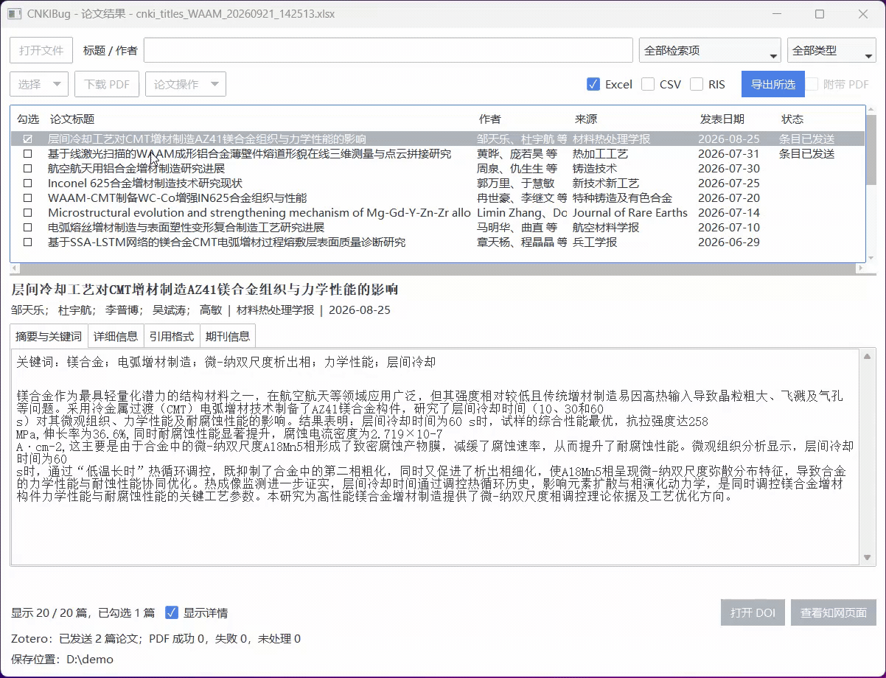
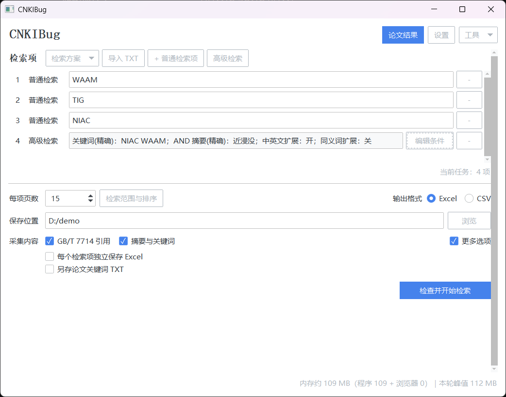
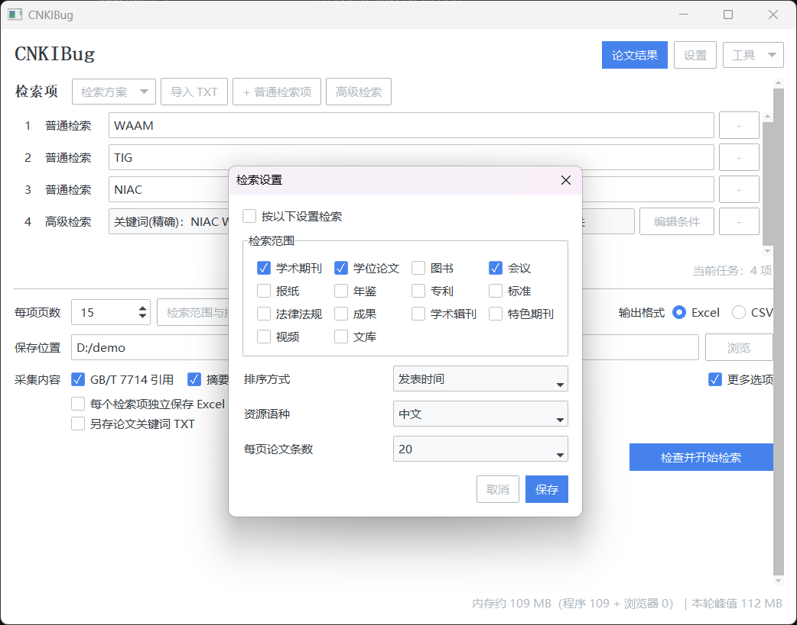
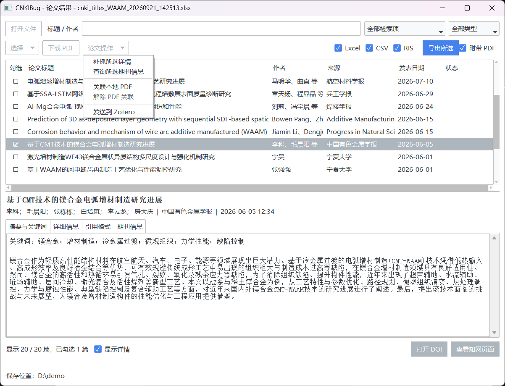
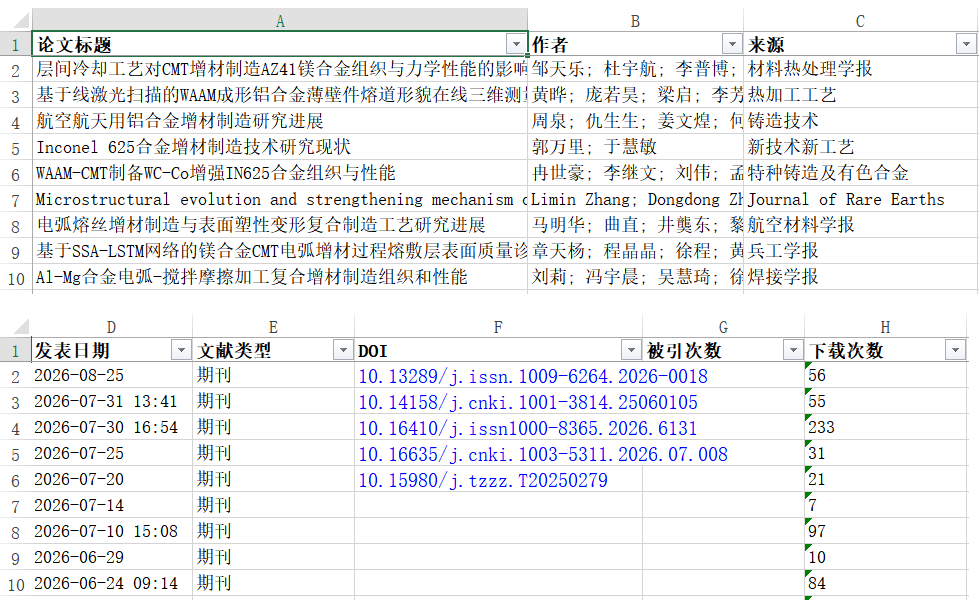
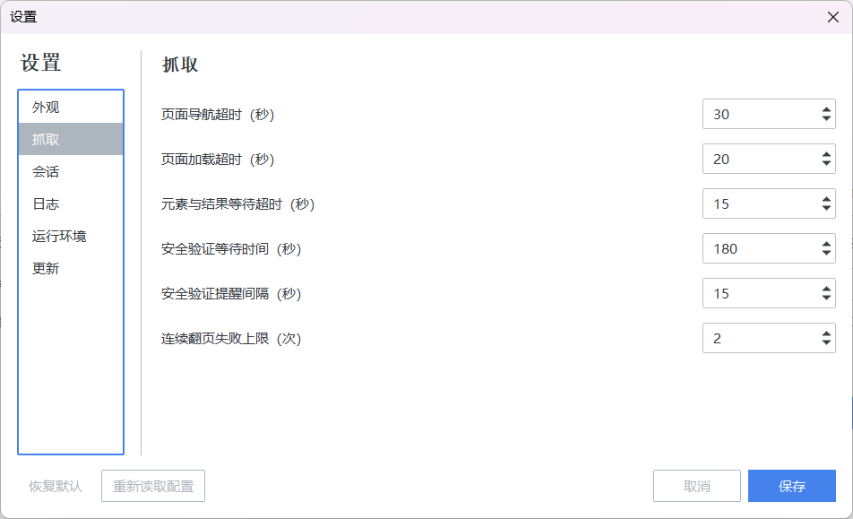

# CNKIBug

面向中国知网（CNKI）的本地文献检索与整理工具，支持批量检索、文献信息采集和结果筛选，可导出 Excel、CSV、RIS，或发送到 Zotero

**[下载 Windows 版](https://github.com/KaffuAlcaid/CNKIBug/releases/latest/download/CNKIBug-GUI.exe)** · [下载 Linux 版](https://github.com/KaffuAlcaid/CNKIBug/releases/latest/download/CNKIBug-GUI-x86_64.AppImage) · [使用说明](docs/usage.md)

快速导航：[功能](#从检索到文献清单) · [开始使用](#开始使用) · [界面与导出](#界面与导出) · [文档与反馈](#文档与反馈) · [许可与致谢](#许可与致谢)

## 从检索到文献清单

| 你要做的事 | CNKIBug 可以帮你 |
| --- | --- |
| 批量收集候选文献 | 输入多组关键词或导入 TXT，组合高级检索条件；保存常用检索方案，中断后从最近完成页继续 |
| 筛选并核对文献 | 按题名、作者、检索项或文献类型筛选，查看摘要、关键词和引文；补抓缺失详情，查询期刊信息 |
| 整理结果并继续研究 | 导出所选文献为 Excel、CSV 或 RIS；发送到 Zotero，关联本地 PDF，或下载有访问权限的全文 |

## 开始使用

Windows 10/11 用户可直接运行下载的 `CNKIBug-GUI.exe`，需要安装 Microsoft Edge

1. **准备检索项**：输入关键词，选择每项页数和保存位置，点击“检查并开始检索”
2. **收集文献**：在打开的浏览器中完成知网要求的人工验证，等待任务执行；需要中断时可安全停止
3. **查看结果**：在“论文结果”中筛选、勾选文献并导出，文件保存在主窗口设置的目录

Linux 提供实验性的 x86-64 AppImage，也可通过源码运行，安装步骤见[使用说明](docs/usage.md#安装与启动)

高级检索、PDF 下载、Zotero 直接发送和期刊信息查询属于实验性功能；下载全文需要对应文献的机构或个人访问权限，具体操作见[使用说明](docs/usage.md)

## 界面与导出

安排普通检索与高级检索任务

选择检索范围、排序和语种

补抓详情、关联 PDF、发送到 Zotero

查看导出的文献字段

[查看完整导出截图](docs/assets/export-full.png)

设置抓取参数与运行环境

## 文档与反馈

- [使用说明](docs/usage.md)：安装、检索、断点恢复、文献整理、Zotero 与 PDF
- [配置说明](docs/configuration.md)：设置窗口、参数含义和运行数据位置
- [开发和打包](docs/development.md)：源码运行、项目结构、构建与测试
- [反馈问题](https://github.com/KaffuAlcaid/CNKIBug/issues/new)：可按[反馈模板](docs/issue-template.md)填写

## 许可与致谢

采用 [MIT License](LICENSE)

CNKIBug 是独立开发的开源项目，与中国知网及其关联方无隶属或合作关系，请在适用法律、知网用户协议和所在机构规定允许的范围内使用

由 [KaffuAlcaid](https://github.com/KaffuAlcaid) 开发维护

感谢 [cloudw233](https://github.com/cloudw233) 提供早期 CI 配置，以及 [Speechlessyc](https://github.com/Speechlessyc) 的图标设计与测试
