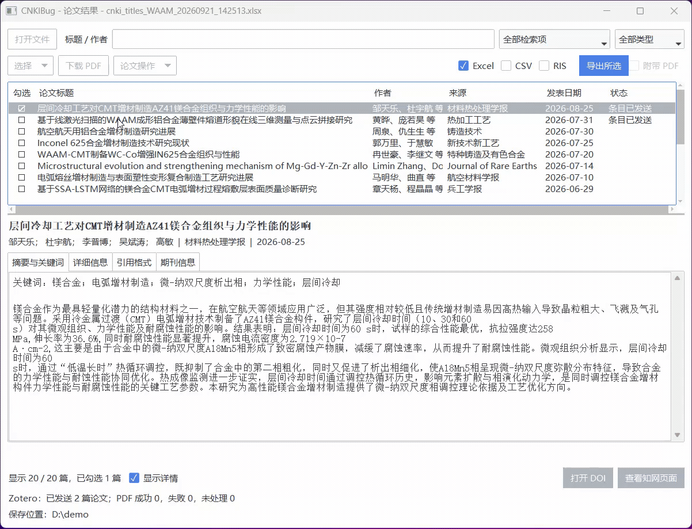
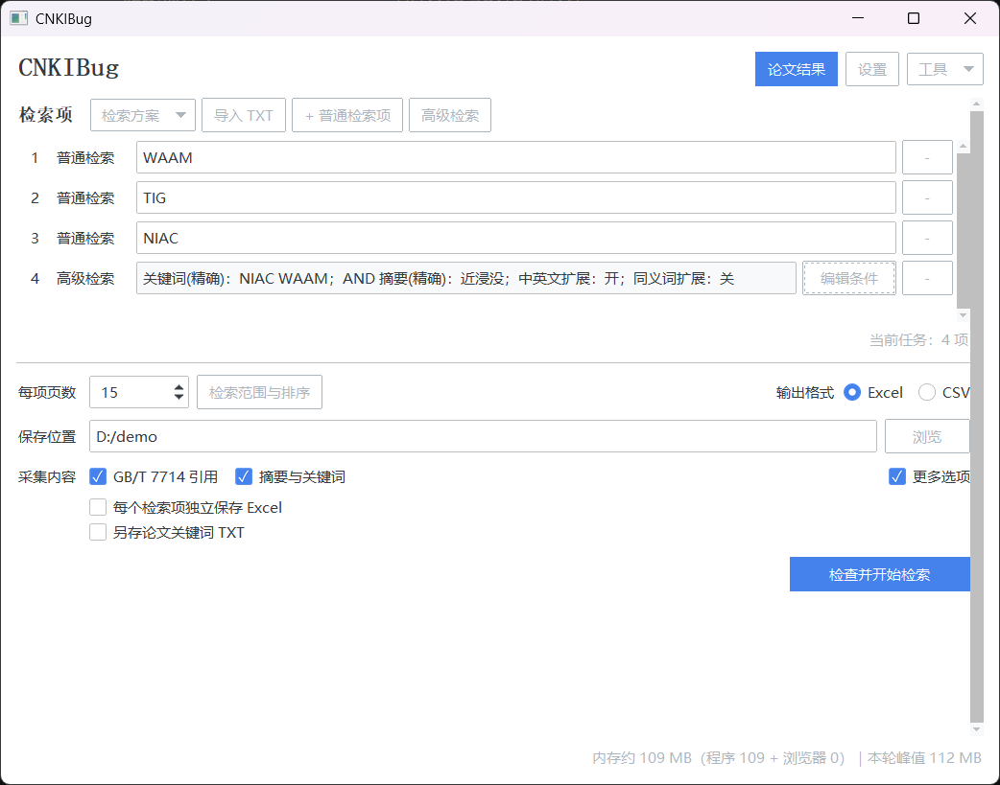
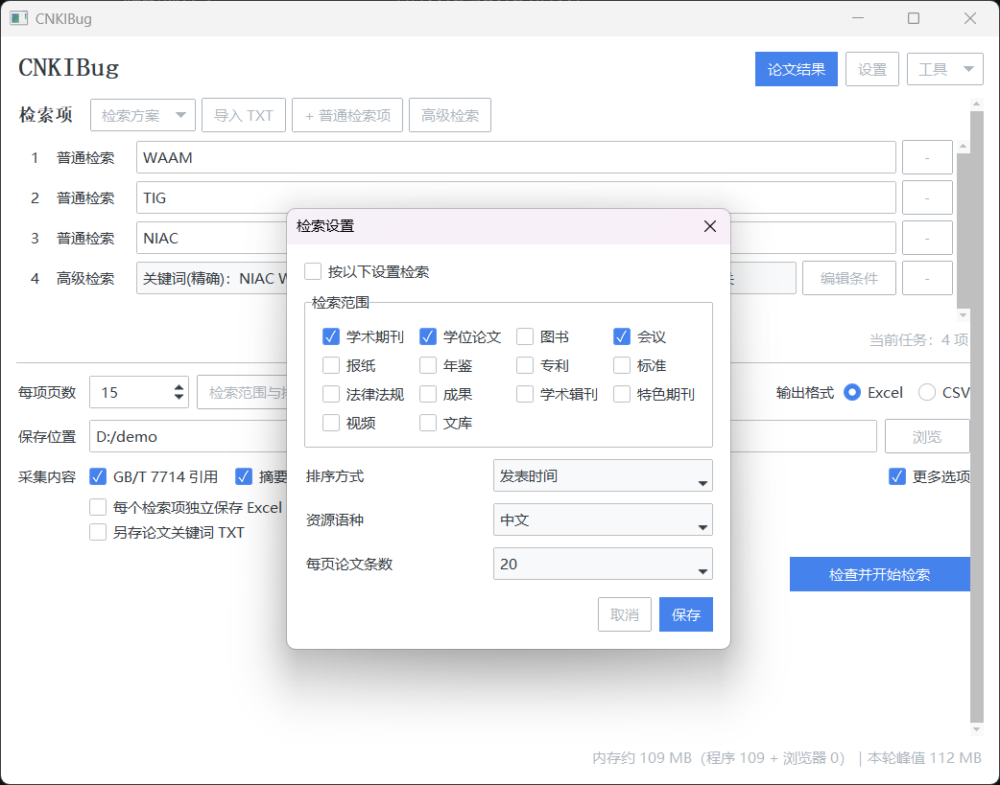
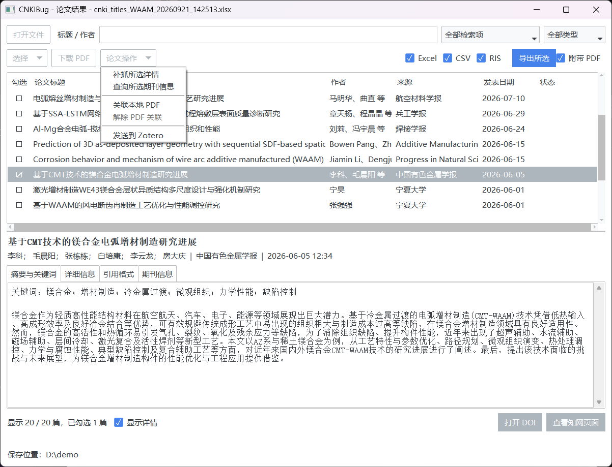
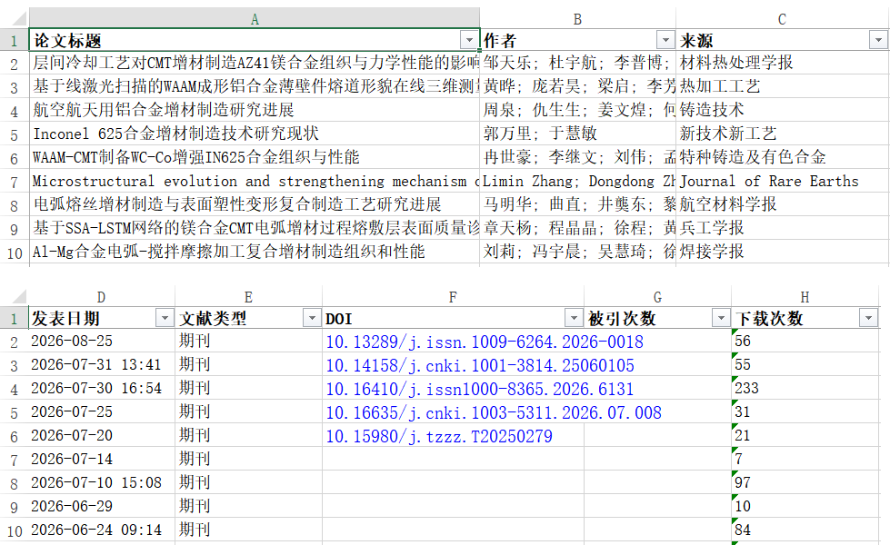
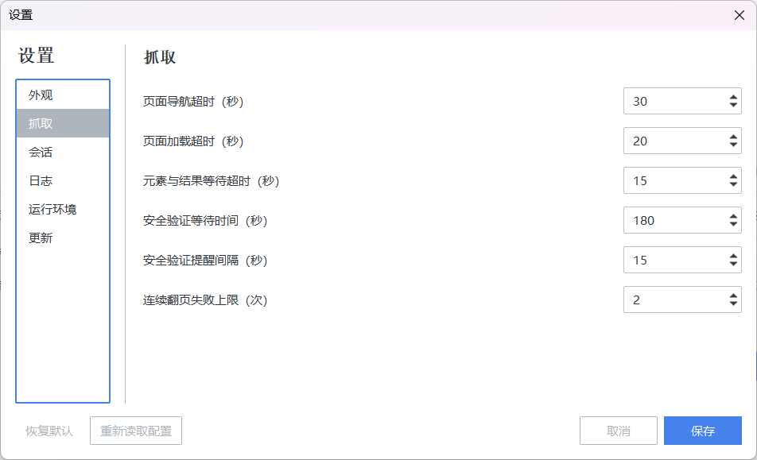

# CNKIBug

CNKIBug 能帮助你围绕研究主题在中国知网（CNKI）上批量查找文献，将多组关键词或检索条件得到的结果汇总筛选后，导出为表格或导入 Zotero

**[下载 Windows 版](https://github.com/KaffuAlcaid/CNKIBug/releases/latest/download/CNKIBug-GUI.exe)** · [下载 Linux 版](https://github.com/KaffuAlcaid/CNKIBug/releases/latest/download/CNKIBug-GUI-x86_64.AppImage) · [使用说明](docs/usage.md)

快速导航：[主要功能](#主要功能) · [开始使用](#开始使用) · [界面与导出](#界面与导出) · [文档与反馈](#文档与反馈) · [许可与致谢](#许可与致谢)

## 主要功能

- **批量检索文献**：输入多组关键词或导入 TXT 列表，也可组合高级检索条件，设置检索范围、排序和语种
- **保存方案与继续任务**：保存常用检索条件，任务中断后可从最近完成页继续
- **查看和筛选结果**：汇总各次检索结果，合并重复文献，按题名、作者、检索项或文献类型筛选，并查看摘要、关键词和引文
- **导出文献**：将选中的文献保存为 Excel、CSV 或 RIS，也可将文献条目和已关联的 PDF 发送到 Zotero
- **下载和关联 PDF**：下载具有访问权限的全文，或为文献关联已经下载的本地文件

高级检索、PDF 下载、Zotero 直接发送和期刊信息查询属于实验性功能，下载全文需要相应的机构或个人访问权限

## 开始使用

Windows 10/11 用户可直接运行下载的 `CNKIBug-GUI.exe`，电脑需要安装 Microsoft Edge

1. **准备检索任务**：输入关键词，设置每项页数和保存位置，点击“检查并开始检索”，确认任务内容后开始
2. **执行检索**：如果知网要求安全验证，在打开的浏览器中手动完成，并按程序提示继续
3. **筛选并导出**：打开“论文结果”，勾选需要保留的文献，选择导出格式并点击“导出所选”

导出文件保存在主窗口设置的目录中

Linux 提供实验性的 x86-64 AppImage，也可通过源码运行，安装步骤和详细操作见[使用说明](docs/usage.md)

## 界面与导出

安排普通检索与高级检索任务

选择检索范围、排序和语种

补抓详情、关联 PDF、发送到 Zotero

查看导出的文献字段

[查看完整导出截图](docs/assets/export-full.png)

设置抓取参数与运行环境

## 文档与反馈

- [使用说明](docs/usage.md)：安装、检索、断点恢复、文献整理、Zotero 与 PDF
- [配置说明](docs/configuration.md)：设置窗口、参数含义和运行数据位置
- [开发和打包](docs/development.md)：源码运行、项目结构、构建与测试
- [反馈问题](https://github.com/KaffuAlcaid/CNKIBug/issues/new)：可按[反馈模板](docs/issue-template.md)填写

## 许可与致谢

采用 [MIT License](LICENSE)

CNKIBug 是独立开发的开源项目，与中国知网及其关联方无隶属或合作关系\
请在适用法律、知网用户协议和所在机构规定允许的范围内使用

由 [KaffuAlcaid](https://github.com/KaffuAlcaid) 开发维护

感谢 [cloudw233](https://github.com/cloudw233) 提供早期 CI 配置，以及 [Speechlessyc](https://github.com/Speechlessyc) 的图标设计与测试
