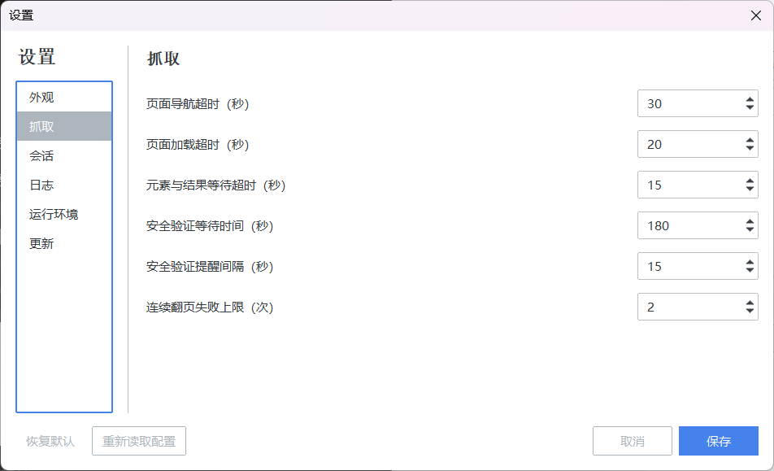

# 配置说明

[返回首页](../README.md) · [使用说明](usage.md)

快速导航：[设置窗口](#通过设置窗口修改) · [常用调整](#常用调整) · [参数](#配置参数) · [数据位置](#配置与数据位置) · [运行环境](#运行环境) · [更新](#更新软件)

## 通过设置窗口修改

在任务设置页右上角点击“设置”，选择需要修改的类别

| 类别 | 可以设置什么 |
| --- | --- |
| 外观 | 浅色或暗色主题 |
| 抓取 | 页面等待、验证等待和翻页失败次数 |
| 会话 | 登录状态复用、有效期和下载前等待时间 |
| 日志 | 日志级别，以及是否记录检索词和保存路径 |
| 运行环境 | 检查浏览器、系统组件和目录权限 |
| 更新 | 检查更新、选择下载线路、测试连接 |

点击“保存”后应用设置；“恢复默认”只填写默认值，确认后仍需点击“保存”

手动编辑 `config.json` 后，可点击“重新读取配置”应用，读取失败时保留当前设置；GUI 开始抓取前也会读取文件，终端版需要重启

## 常用调整

| 遇到的情况 | 建议调整 |
| --- | --- |
| 页面加载慢，经常超时 | 在“抓取”中适当增加页面导航、页面加载、元素与结果等待时间 |
| 验证码还没处理完，程序已停止等待 | 增加“安全验证等待时间” |
| 机构授权需要更长时间 | 在“会话”中增加“下载前首页等待（秒）” |
| 保存的登录状态异常 | 关闭复用浏览器会话，重新完成登录 |
| 分享日志时希望省去本机路径 | 关闭日志中的保存路径记录 |
| 需要将论文关键词用于下一轮检索 | 在任务的“更多选项”中勾选“另存论文关键词 TXT” |

## 配置参数

配置文件使用 JSON，布尔值写为 `true` 或 `false`，路径中的 Windows 反斜杠需要写成 `\\`，也可以使用 `/`

设置窗口中的时间以秒显示，下面三个以 `_ms` 结尾的配置项以毫秒保存，例如 `30000` 表示 30 秒

### 抓取与等待

| 参数 | 默认值 | 含义 |
| --- | --- | --- |
| `timeout_goto_ms` | `30000` | 打开知网页面的最长等待时间，毫秒 |
| `timeout_load_ms` | `20000` | 等待页面加载的最长时间，毫秒 |
| `timeout_selector_ms` | `15000` | 等待搜索框、结果表格等控件的最长时间，毫秒 |
| `verify_wait_timeout_sec` | `180` | 等待人工完成安全验证的最长时间，秒 |
| `verify_notice_interval_sec` | `15` | 等待验证期间的提醒间隔，秒 |
| `max_advance_fail` | `2` | 连续翻页失败达到该次数后，结束当前检索项 |

这些参数均填写正整数

### 浏览器会话

| 参数 | 默认值 | 含义 |
| --- | --- | --- |
| `session_cache_enabled` | `true` | 复用已保存的浏览器登录状态 |
| `session_cache_ttl_hours` | `12` | 登录状态有效期，填写正整数，单位为小时 |
| `download_auth_wait_sec` | `60` | 下载前在知网首页等待授权的时间，填写非负整数，单位为秒 |

抓取与 PDF 下载分别保存登录状态，使用相同的有效期设置，具体目录见[配置与数据位置](#配置与数据位置)

### 日志

| 参数 | 默认值 | 含义 |
| --- | --- | --- |
| `log_level` | `"INFO"` | `INFO` 记录常规过程，`WARNING` 记录警告与错误，`ERROR` 只记录错误 |
| `log_save_path` | `true` | 在日志中记录导出文件路径 |
| `log_keywords` | `false` | 在日志中记录检索词 |
| `log_scraped_records` | `false` | 在日志中记录详细抓取统计 |

### 导出与外观

| 参数 | 默认值 | 含义 |
| --- | --- | --- |
| `detail_txt_export` | `false` | 采集论文详情时，额外导出论文关键词 TXT |
| `output_dir` | `""` | 文献保存目录，留空时使用默认桌面目录 |
| `gui_theme` | `"litera"` | `litera` 为浅色，`darkly` 为暗色 |
| `update_source` | `"auto"` | `auto` 自动选择，也可填 `ghproxy.net`、`ghfast.top`、`gh-proxy.org` 或 `direct` |

### 程序管理的参数

| 参数 | 默认值 | 含义 |
| --- | --- | --- |
| `version` | `2` | 配置文件格式版本，由程序维护 |
| `linux_setup_completed` | `false` | Linux AppImage 是否完成首次设置，由初始化窗口保存 |

## 配置与数据位置

在下列目录中可以找到 `config.json`，日志、登录状态和任务记录也存放在这里

| 启动方式 | 数据目录 |
| --- | --- |
| Windows EXE、直接运行源码 | 启动文件所在目录的 `CNKIBug-data/` |
| Linux AppImage、Linux Python 包 | `~/.local/share/CNKIBug-data/` |
| Windows Python 包 | `%LOCALAPPDATA%/CNKIBug-data/` |

Linux 设置了 `XDG_DATA_HOME` 时，使用该目录下的 `CNKIBug-data/`

| 内容 | 数据目录内的位置 |
| --- | --- |
| 配置 | `config.json` |
| 日志 | `log/` |
| 任务报告 | `status/` |
| 抓取登录状态 | `cache/cookies` |
| PDF 下载登录状态 | `cache/download_cookies` |

如需清除某类登录状态，先结束相关任务，再删除对应的登录状态文件；下载登录状态为空时，程序可能读取仍有效的抓取登录状态

文献导出和 PDF 的保存位置由主窗口指定，分享日志或报告前请检查个人路径和登录信息

## 运行环境

在“设置 → 运行环境”中点击“开始检查”，可以检查程序组件、浏览器、系统组件和目录写入权限，检查期间可能短暂打开空白浏览器窗口

Windows 优先使用 Microsoft Edge，Linux 依次尝试系统 Chrome、系统 Chromium 和通过程序安装的 Chromium

| 检查结果 | 处理方法 |
| --- | --- |
| Linux 找不到浏览器 | 点击“安装 Chromium”，完成后重新检查 |
| Ubuntu/Debian 缺少系统组件 | 按检查页面提供的安装命令处理 |
| Fedora 缺少浏览器或组件 | 可运行 `sudo dnf install chromium` 安装系统浏览器 |
| 保存目录不可写 | 更换到当前用户可写的目录 |

Linux AppImage 首次设置检查通过后，点击“开始使用”；选择“稍后设置”会在下次启动时再次显示初始化窗口

程序下载的 Chromium 默认位于 `~/.cache/ms-playwright/`，设置 `XDG_CACHE_HOME` 时使用其下的 `ms-playwright/`，也可通过 `PLAYWRIGHT_BROWSERS_PATH` 指定位置

## 更新软件

打开“设置 → 更新”，选择下载线路后点击“检查更新”，连接不畅时可先点击“测试连接”

检查更新时先从 GitHub 读取最新正式版本，再与本地版本比较；无法取得发布信息时会提示检查失败，下载线路用于选择安装包的下载方式

测试连接分别检查更新信息服务和所选线路的响应，线路检查读取仓库中的小文件；连接成功不代表安装包能够完整下载，显示的响应耗时也不代表下载速度。线路检查未确认时，仍可尝试更新或选择其他线路

| 下载线路 | 行为 |
| --- | --- |
| 自动 | 依次尝试三个加速源，最后使用 GitHub 原始地址 |
| 指定加速源 | 使用所选线路 |
| 无加速（系统代理） | 使用 GitHub 原始地址，并沿用支持的系统或环境代理设置 |

Windows EXE 和 Linux AppImage 支持下载更新、替换程序并重启，配置、登录状态和文献文件保留

AppImage 所在目录可写时沿用原文件名和位置，否则可选择另一个位置保存；Python 包和源码安装的更新方式见各自安装说明

[Python 包更新](pypi.md#更新) · [源码更新](development.md#更新源码)
