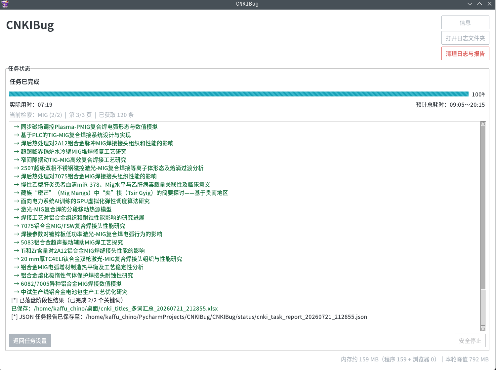
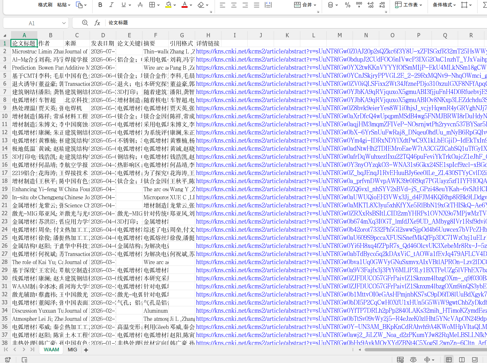

# 使用说明

[返回首页](../README.md)

## 完整截图

<table style="border: none;">
  <tr>
    <td style="text-align: center; vertical-align: top; width: 50%;">
      
       <b>输入关键词与设置</b>
    </td>
    <td style="text-align: center; vertical-align: top; width: 50%;">
      
       <b>确认任务与预计耗时</b>
    </td>
  </tr>
  <tr>
    <td style="text-align: center; vertical-align: top; width: 50%;">
      
       <b>GUI 抓取过程</b>
    </td>
    <td style="text-align: center; vertical-align: top; width: 50%;">
      
       <b>终端抓取过程</b>
    </td>
  </tr>
  <tr>
    <td style="text-align: center; vertical-align: top; width: 50%;">
      
       <b>任务完成</b>
    </td>
    <td style="text-align: center; vertical-align: top; width: 50%;">
      
       <b>结果文件</b>
    </td>
  </tr>
</table>

## 导入关键词

GUI 可把 TXT 内容追加或替换到任务列表；终端版仅在多关键词模式下提供 TXT 导入。

TXT 必须是 UTF-8 编码，每个非空行是一项。程序会去掉行首和行尾空白、忽略空行，并按首次出现顺序去重；关键词内部空格会保留。文件不能超过 1 MiB，去重后最多 1000 项。

## 开始任务

开始浏览器前会显示关键词、页数、保存方式、引文、论文详情和预计耗时，可以返回修改。知网每页通常约 20 条结果，抓取约 100 条可填写 5 页；预计上限超过 10 分钟会提示风险。

运行中会显示预计进度百分比、已用时、预计总耗时和内存参考值。GUI 底部会持续显示内存，结束后“已用时”会变为“实际用时”；终端版每轮结束后会显示一次内存参考值。

按 `Ctrl+C` 或关闭浏览器可以安全停止，已完成页会保存。下次恢复时从最近完成页继续。

## 导出内容

单关键词可导出 Excel 或 CSV；多关键词可选每个关键词一个 Excel、单个 Excel 多 Sheet 或单个 CSV。Excel 中包含可点击的 CNKI 详情链接。

开启论文详情后，程序会串行获取关键词和摘要；英文文献没有关键词时留空。全部可选字段开启时，Excel 列为“论文标题、作者、来源、发表日期、论文关键词、摘要、引用格式、详情链接”。单条详情或引文失败时留空、记入日志并继续。

终端版将 `detail_txt_export` 设为 `true` 后，开启论文详情的任务会额外生成 `cnki_paper_keywords_时间戳.txt`；GUI 可在任务开始前直接勾选。该文件为 UTF-8 BOM、一行一个关键词，保留原始顺序和重复项，可直接重新导入软件。

每轮任务会在 `CNKIBug/status/` 生成 `cnki_task_report_时间戳.json`，其中包含关键词状态、失败原因、记录数、字段缺失、引文和论文详情统计。报告不包含完整论文记录；中止时未执行的关键词标记为 `not_started`。
