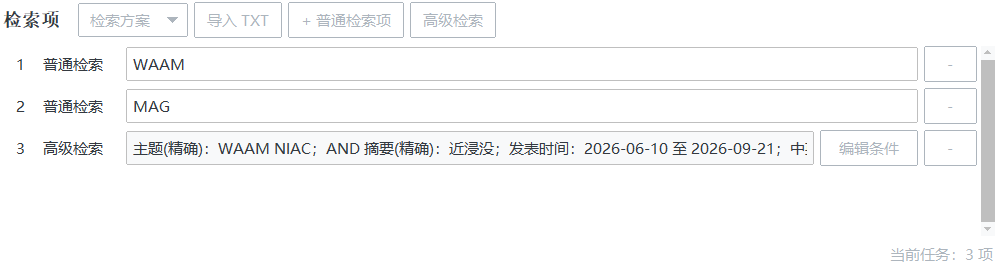
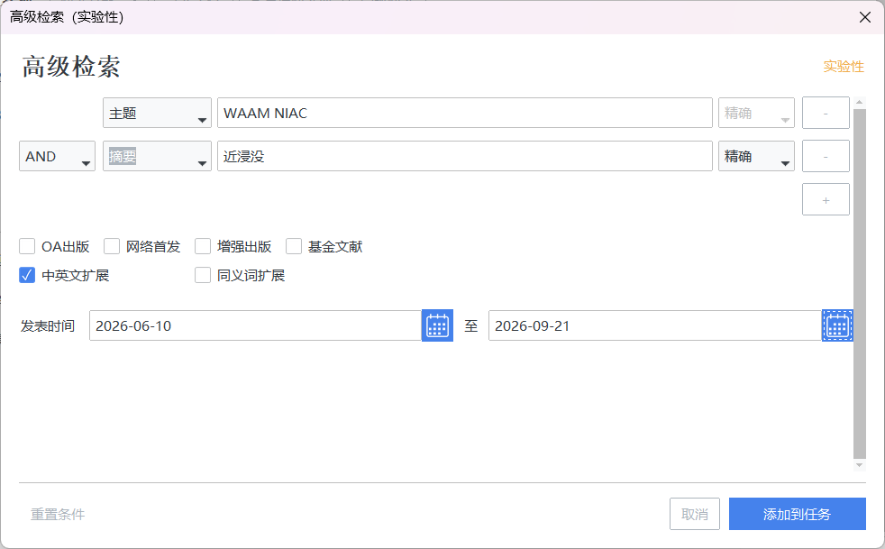
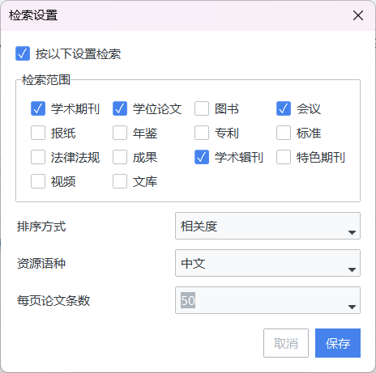
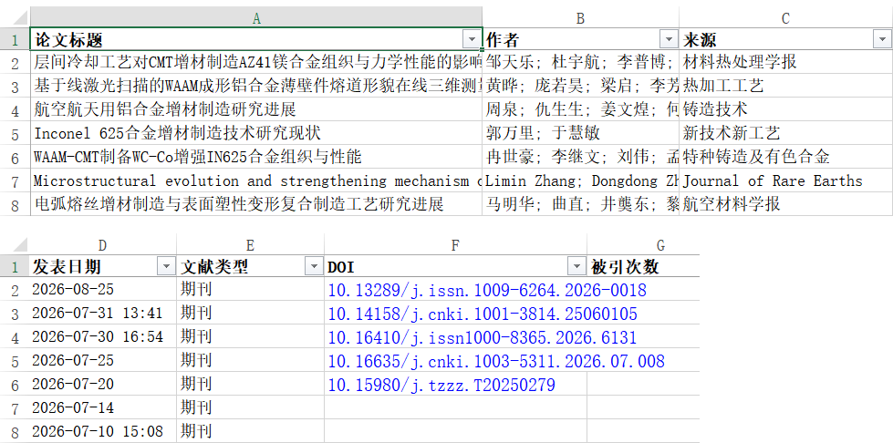
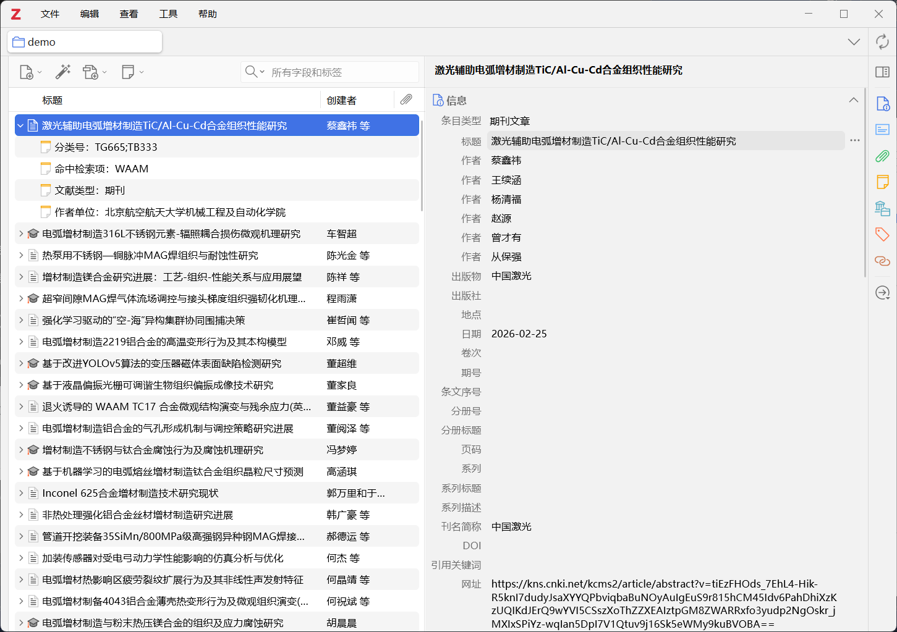

# 使用说明

[返回首页](../README.md)

快速导航：[安装](#安装与启动) · [检索](#准备检索任务) · [停止与续跑](#停止与续跑) · [筛选结果](#查看和筛选结果) · [导出](#导出文献) · [Zotero](#发送到-zotero) · [PDF](#下载与关联-pdf) · [期刊信息](#查询期刊信息)

## 安装与启动

### Windows

1. 下载 [CNKIBug-GUI.exe](https://github.com/KaffuAlcaid/CNKIBug/releases/latest/download/CNKIBug-GUI.exe)
2. 确认电脑已安装 Microsoft Edge，双击 EXE 启动
3. 在主窗口选择文献的保存位置

打包版自带 Python，支持 Windows 10/11

### Linux

AppImage 支持 x86-64，目前属于实验性支持，需要可用的图形桌面

下载 [CNKIBug-GUI-x86_64.AppImage](https://github.com/KaffuAlcaid/CNKIBug/releases/latest/download/CNKIBug-GUI-x86_64.AppImage)，在文件所在目录运行：

```bash
chmod +x CNKIBug-GUI-x86_64.AppImage
./CNKIBug-GUI-x86_64.AppImage
```

首次启动时，选择保存目录并点击“开始检查”，根据结果准备浏览器和系统组件，检查通过后点击“开始使用”

浏览器选择与安装方法见[运行环境](configuration.md#运行环境)

### Python 包或源码

Python 包的安装命令见 [Python 包安装](pypi.md)，源码运行见[开发说明](development.md#从源码运行)

终端版同样需要图形桌面来完成知网验证，macOS 源码运行目前不在正式支持范围

## 准备检索任务

### 输入关键词

在任务列表中直接输入，每行对应一个检索项

- 点击“+ 普通检索项”继续添加，点击行末减号移除
- 在普通项中按 Enter 移到下一项，末行按 Enter 可继续输入
- 点击“高级检索”组合多个条件，之后可通过该行的“编辑条件”重新打开

普通项和高级项按列表顺序执行，空白行会被忽略，重复项会提示编辑或移除



### 从 TXT 导入

在 TXT 文件中每行填写一个关键词，例如：

```text
电弧增材制造
Inconel 625
层间冷却
```

点击“导入 TXT”，根据提示选择追加或替换当前列表

导入会去掉行首尾空白、忽略空行并按首次出现顺序去重，关键词内部空格保留

文件要求：UTF-8 编码，最大 1 MiB，去重后最多 1000 项

终端版在多关键词模式中提供 TXT 导入

### 组合高级条件

在高级检索窗口中选择字段、填写条件，用 AND、OR 或 NOT 连接，也可按需设置发表时间和扩展选项



高级检索属于实验性功能，首次使用时建议先用少量条件核对知网页面上的实际结果

### 选择范围和采集内容

点击“检索范围与排序”，勾选“按以下设置检索”后选择资源类别、排序、语种和每页条数；未勾选时沿用知网页面的设置

主窗口的“每项页数”决定每个检索项抓取多少页，弹窗里的“每页论文条数”可选 10、20 或 50 条



按需要勾选“GB/T 7714 引用”或“摘要与关键词”，这些内容需要逐篇访问，任务耗时会相应增加

点击“检查并开始检索”核对任务内容和预计耗时，确认后开始；遇到安全验证时，在浏览器中手动完成并按提示继续

### 保存常用方案

在“检索方案”菜单中选择“保存方案”，可将检索项、条件、页数、保存位置和输出选项存为 JSON 文件

下次使用“载入方案”恢复，当前表单会被替换，载入后仍需确认并开始任务

## 停止与续跑

- GUI：点击“安全停止”，等待当前任务结束
- 终端版：按 `Ctrl+C`
- 下次启动时选择继续上次任务，从最近完成页接着执行

运行中可查看进度、已用时间和日志，任务完成后显示实际用时

## 查看和筛选结果

点击主窗口的“论文结果”，上方查看列表，下方查看所选文献的摘要、详情和引文

| 操作 | 方法 |
| --- | --- |
| 查找文献 | 在搜索框输入题名或作者 |
| 缩小范围 | 选择检索项或文献类型 |
| 排序 | 点击列表表头 |
| 选择文献 | 勾选需要导出或处理的行 |
| 调整阅读空间 | 拖动列表与详情之间的分隔线 |
| 打开已有结果 | 点击“打开文件”，选择 CNKIBug 导出的 XLSX 或 CSV |

重复文献会合并显示，“命中检索项”保留找到它的检索条件；多个 Excel 工作表会汇总到同一列表，缺少的字段留空

关闭结果窗口后，在同一次程序运行中重新打开，筛选、勾选和 PDF 关联会保留；开始新任务会清空上一轮结果，重要内容请先导出

窗口中的文献信息为只读，缺失内容可勾选后通过“论文操作 → 补抓所选详情”获取，已有字段保持原值，补抓后记得导出保存

## 导出文献

1. 勾选需要保存的文献
2. 勾选 Excel、CSV 或 RIS，可同时选择多种格式
3. 点击“导出所选”，文件保存在主窗口设置的目录

多种格式共用文件名前缀，某种格式导出失败时，窗口会显示原因，其他成功导出的文件仍然保留

任务结束时也会自动保存检索结果：单个检索项保存为 Excel 或 CSV；多个检索项可合并到一个 CSV、一个 Excel 的多个工作表，或按项分别保存 Excel

### 导出哪些字段

| 内容 | 字段 |
| --- | --- |
| 基本文献信息 | 题名、作者、来源、发表日期、文献类型、DOI、被引次数、下载次数、详情链接、命中检索项 |
| 论文详情 | 摘要、关键词、作者单位、基金、分类号、卷、期、页码 |
| 引文 | GB/T 7714 引用格式 |

Excel 和 CSV 使用相同的中文表头，字段按知网页面实际内容填写，缺失时留空



[查看完整导出截图](assets/guide/export-full.png)

### 另存论文关键词

在任务设置的“更多选项”中勾选“另存论文关键词 TXT”，可将抓取到的论文关键词保存为文本

文件名为 `cnki_paper_keywords_时间戳.txt`，使用 UTF-8 BOM 编码，每行一个词，保留原顺序和重复项，可重新导入为检索项

终端版对应设置为 [`detail_txt_export`](configuration.md#导出与外观)，需要同时采集论文详情

## 发送到 Zotero



### 通过 RIS 导入

导出时勾选 RIS，然后在 Zotero 中选择“文件 → 导入”并打开生成的文件

“命中检索项”会写入文献备注，勾选“附带 PDF”可带上已关联文件的路径；导入时请保持这些 PDF 的路径有效

部分文献类型无法准确对应 Zotero，程序会提示，可同时导出 Excel 或 CSV 保留原始信息

### 直接发送

1. 打开 Zotero 桌面端，选好目标文库或分类
2. 在 CNKIBug 中勾选文献，选择“论文操作 → 发送到 Zotero”
3. 核对目标和数量，确认后发送文献信息及已关联的 PDF

直接发送属于实验性功能，列表会显示条目和附件各自的发送结果

重复发送会创建新条目；连接中断或超时后，先检查 Zotero 中已有的内容，再决定是否重试，附件失败时已写入的条目仍然保留

## 下载与关联 PDF

### 下载全文

PDF 下载属于实验性功能，需要文献对应的全文访问权限

1. 按学校或机构要求连接访问网络，或准备具有全文权限的个人账号
2. 勾选文献并点击“下载 PDF”，在浏览器中完成登录或机构授权
3. 准备完成后点击“立即继续”，也可等待首页准备时间结束后开始

首页默认等待 60 秒，可在“设置 → 会话 → 下载前首页等待（秒）”中设置

PDF 保存到主窗口设置的目录，列表中可查看下载状态；点击“停止下载”结束当前下载，已完成的文件保留

每批结束后浏览器会关闭，下次下载会读取保存的登录信息，部分机构可能需要重新授权

### 通过学校 WebVPN 下载

这项功能供有校外访问等特殊需求、需要通过学校 WebVPN 访问知网的学生和研究者按需使用

在下载确认框中点击“使用机构 WebVPN 登录”，填入学校提供的完整知网网址，完成网页登录后点击“登录完成，继续”

目前支持以下域名形式，网址中的学校域名和页面路径都应完整保留：

```text
www-cnki-net-443.<学校域名>
kns-cnki-net-443.<学校域名>
```

对于 `webvpn.<学校域名>/https/编码/...` 等路径加密入口或其他门户形式，请在学校 WebVPN 页面手动下载，再关联到文献

需要补充其他学校入口或有使用建议时，欢迎[提交 Issue](https://github.com/KaffuAlcaid/CNKIBug/issues/new)，说明入口地址形式和使用场景

### 关联已下载的文件

只勾选一篇文献，选择“论文操作 → 关联本地 PDF”并选择文件

关联在本次程序运行中保留，原文件仍位于原处；选择“解除 PDF 关联”只移除关联记录，文件也会保留

关联后可将文献与 PDF 一起发送到 Zotero，或导出带文件路径的 RIS

## 查询期刊信息

勾选期刊论文，选择“论文操作 → 查询所选期刊信息”，在下方“期刊信息”页查看结果

查询属于实验性功能，同一期刊在一批操作中只查询一次，可显示页面提供的 ISSN、CN、主办单位、收录信息、影响因子原文和来源

指标年份以来源页面为准，查询时间只表示何时取得信息；页面缺少收录信息时，仍需进一步核实，遇到同名刊物可点击“查看期刊来源”确认

## 查找日志与报告

通过“工具 → 打开日志文件夹”查看运行日志

每轮任务还会生成 `cnki_task_report_时间戳.json`，记录各检索项的状态、记录数、失败原因和字段缺失情况，中止时尚未执行的项标记为 `not_started`

报告位于[运行数据目录](configuration.md#配置与数据位置)的 `status/`，文献内容仍以导出文件为准

需要反馈时，可填写[问题反馈模板](issue-template.md)
