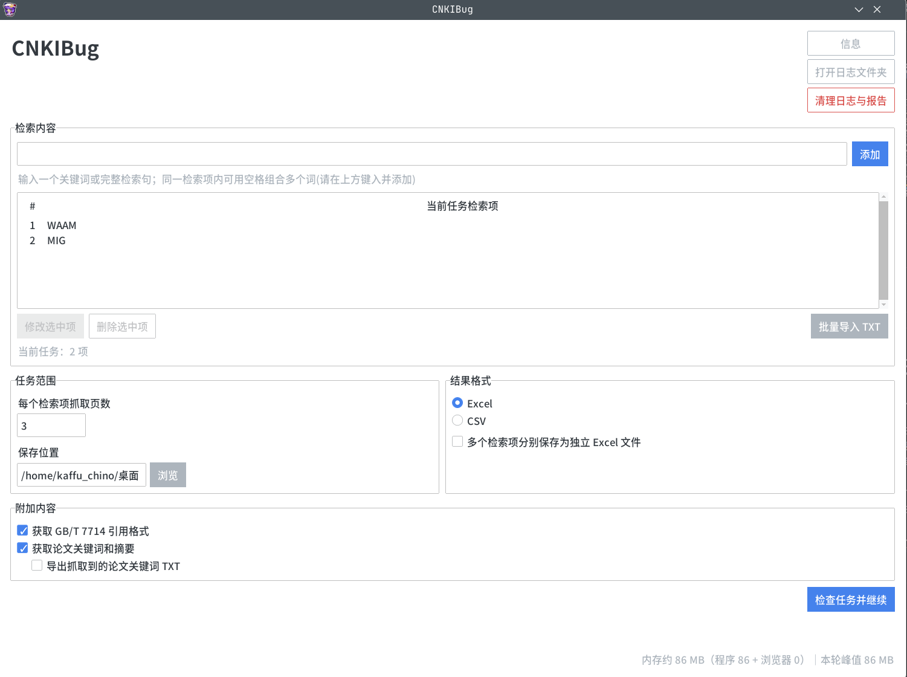
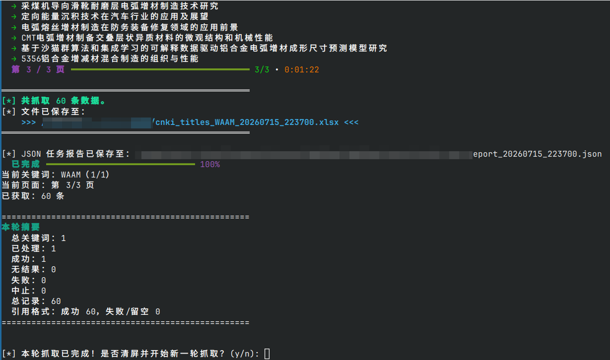
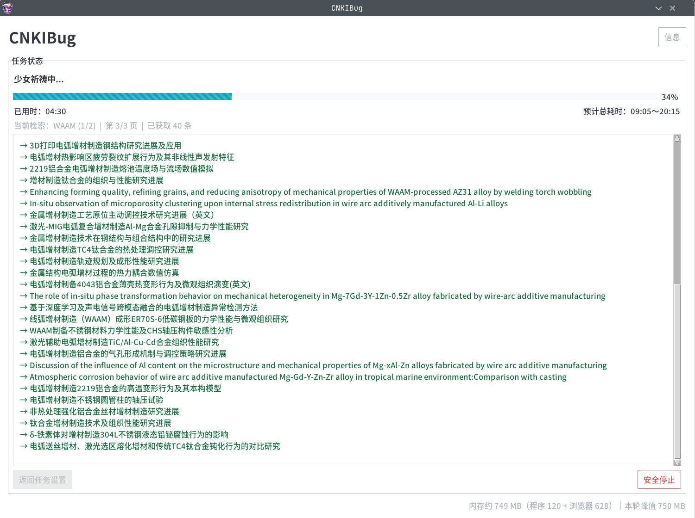
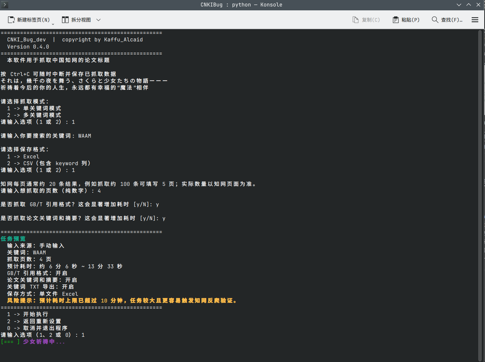
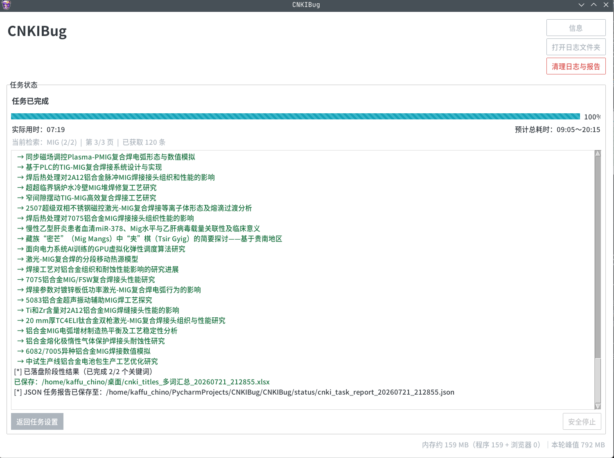
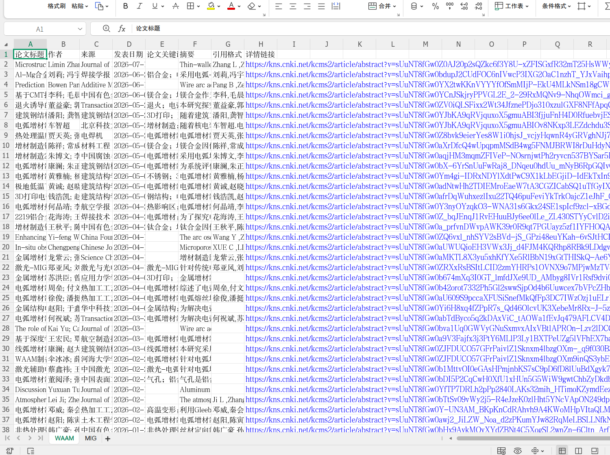

# 使用说明

[返回首页](../README.md)

## 完整截图

<table style="border: none;">
  <tr>
    <td style="text-align: center; vertical-align: top; width: 50%;">
      
       <b>输入关键词与设置</b>
    </td>
    <td style="text-align: center; vertical-align: top; width: 50%;">
      
       <b>确认任务与预计耗时</b>
    </td>
  </tr>
  <tr>
    <td style="text-align: center; vertical-align: top; width: 50%;">
      
       <b>GUI 抓取过程</b>
    </td>
    <td style="text-align: center; vertical-align: top; width: 50%;">
      
       <b>终端抓取过程</b>
    </td>
  </tr>
  <tr>
    <td style="text-align: center; vertical-align: top; width: 50%;">
      
       <b>任务完成</b>
    </td>
    <td style="text-align: center; vertical-align: top; width: 50%;">
      
       <b>结果文件</b>
    </td>
  </tr>
</table>

## 输入检索项

GUI 的普通检索项可在任务列表中直接输入、编辑，每行一项。点击“+ 普通检索项”可继续添加；在普通项中按 Enter 可移到下一项，在末行按 Enter 可继续输入。每行右侧的减号用于移除该项。

高级检索通过“高级检索”添加，与普通项按列表顺序混合执行；点击对应行的“编辑条件”可打开条件编辑器。

点击“检查并开始检索”或保存检索方案时，程序读取各行当前内容，忽略空白行，保留关键词内部空格。重复项会提示编辑或移除。

## 导入关键词

GUI 可把 TXT 内容追加或替换到任务列表；终端版仅在多关键词模式下提供 TXT 导入。

TXT 必须是 UTF-8 编码，每个非空行是一项。程序会去掉行首和行尾空白、忽略空行，并按首次出现顺序去重；关键词内部空格会保留。文件不能超过 1 MiB，去重后最多 1000 项。

## 开始任务

开始浏览器前会显示关键词、页数、保存方式、引文、论文详情和预计耗时，可以返回修改。任务范围中的“检索设置”可选择资源类别、排序、语种及每页 10、20、50 条；关闭该选项时沿用知网页面设置。预计上限超过 10 分钟会提示风险。

运行中会显示预计进度百分比、已用时、预计总耗时和内存参考值。GUI 底部会持续显示内存，结束后“已用时”会变为“实际用时”；终端版每轮结束后会显示一次内存参考值。

按 `Ctrl+C` 或关闭浏览器可以安全停止，已完成页会保存。下次恢复时从最近完成页继续。

## 检索方案

任务设置中的“检索方案”菜单可将普通检索项、高级条件、检索范围、保存位置和输出选项保存为 JSON 文件。通过“载入方案”可恢复这些设置；载入时会替换当前任务表单，之后仍需检查并开始检索。

## 导出内容

单关键词可导出 Excel 或 CSV；多关键词可选每个关键词一个 Excel、单个 Excel 多 Sheet 或单个 CSV。Excel 中包含可点击的 CNKI 详情链接。

XLSX 和 CSV 使用相同的中文表头。基本列为论文标题、作者、来源、发表日期、文献类型、DOI、被引次数、下载次数、详情链接、命中检索项。开启详情采集时还包含论文关键词、摘要、作者单位、基金、分类号、卷、期、页码；开启引文采集时包含引用格式。各字段按知网页面实际内容填写，缺失时留空。

终端版将 `detail_txt_export` 设为 `true` 后，开启论文详情的任务会额外生成 `cnki_paper_keywords_时间戳.txt`；GUI 可在任务开始前直接勾选。该文件为 UTF-8 BOM、一行一个关键词，保留原始顺序和重复项，可直接重新导入软件。

每轮任务会在 `CNKIBug-data/status/` 生成 `cnki_task_report_时间戳.json`，其中包含关键词状态、失败原因、记录数、字段缺失、引文和论文详情统计。报告不包含完整论文记录；中止时未执行的关键词标记为 `not_started`。

## 论文结果

任务结束后，可选择展示论文详情，也可稍后点击主窗口的“论文结果”。独立结果窗口上方显示列表，下方显示摘要、完整字段和引用格式；上下区域高度可拖动调整。支持按标题或作者搜索、按检索项或文献类型筛选、表头排序，以及勾选论文。

结果列表汇总本轮任务，包括继续上次任务时已经取得的论文。重复论文合并显示，“命中检索项”保留找到它的搜索条件。

在同一次程序运行中，关闭结果窗口后重新打开，筛选条件、勾选和已下载 PDF 的关联仍然保留。下载过程中关闭窗口，需要先确认停止并等待下载结束。

开始新任务后，已有结果窗口清空上一轮内容；任务结束后显示本次结果。完成提示中的选择决定是否展示窗口，稍后点击“论文结果”也可查看本次数据。

“打开文件”可读取 CNKIBug 导出的 XLSX 和 CSV，兼容旧版中文 Excel 表头和英文 CSV 表头。多个工作表会汇总显示，缺少的字段留空。窗口中的论文信息为只读。

勾选论文后，通过“论文操作 → 补抓所选详情”可补充缺失的摘要、关键词、DOI 等信息，已有字段保持原值。处理过程中可停止；遇到安全验证时按提示在浏览器中完成。补抓结果保留在当前列表，可通过导出保存。

只勾选一篇论文时，可通过“论文操作 → 关联本地 PDF”选择手动下载的文件，或通过“解除 PDF 关联”移除列表中的关联。原文件不会移动或删除，关联随本次程序运行中的结果列表保留。

勾选论文后，在窗口上方勾选需要的 Excel、CSV、RIS 格式，再点击“导出所选”。可一次导出多种格式，文件共用名称前缀并保存到主窗口设置的目录。某种格式失败时，其他格式仍会保存，窗口显示具体结果。

Zotero 文件可通过 Zotero 的“文件 → 导入”读取，命中检索项保存在文献备注中；勾选“附带 PDF”可关联已经下载的 PDF。导入时应保持 PDF 文件路径有效。

文献类型无法明确对应到 Zotero 时，窗口会提示使用 Excel 或 CSV 保存结果。

### 直接发送到 Zotero（实验性）

启动 Zotero 桌面端并选择目标文库或分类。勾选论文后使用“论文操作 → 发送到 Zotero”，确认目标和数量后发送文献信息及已关联的 PDF。列表和详情中分别显示发送结果；附件失败不撤销已保存的文献条目。

重复发送会创建新条目。连接中断或响应超时时，请先在 Zotero 中核对已有结果，再决定是否重新发送。原有 RIS 文件导出仍可使用。

### 期刊信息（实验性）

勾选期刊论文后使用“论文操作 → 查询所选期刊信息”。同一期刊在一批任务中只查询一次，结果显示在下方的“期刊信息”页，包括页面提供的 ISSN、CN、主办单位、收录信息和影响因子原文，以及来源和查询时间。

收录和指标年份以页面原文为准；查询时间不代表指标年份。页面未提供信息时不判断为未收录。遇到同名刊物或名称不一致时，可通过“查看期刊来源”在知网核对。

## 下载 PDF（实验性）

勾选论文后点击“下载 PDF”，阅读访问权限说明并确认。下载前默认等待 60 秒，准备好后可点击“立即继续”提前开始。

PDF 自动保存到主窗口设置的目录，每篇论文的进度和结果显示在“下载状态”列。

可在“设置 → 会话 → 下载前首页等待（秒）”中设置等待时间。机构用户使用学校或机构提供的访问网络，个人用户使用具有对应文献下载权限的账号。

WebVPN 下载目前支持 `www-cnki-net-443.<学校域名>`、`kns-cnki-net-443.<学校域名>` 形式的知网入口，网址中需包含完整学校域名，也可包含学校提供的检索页面路径。在下载确认框点击“使用机构 WebVPN 登录”，填入完整网址；完成网页登录后，回到论文结果窗口点击“登录完成，继续”。

对于 `webvpn.<学校域名>/https/编码/...` 形式的入口和其他类型的门户，请在学校 WebVPN 浏览器页面中手动下载 PDF。输入网址或等待登录期间识别到路径加密型入口时，程序会提示“暂不支持路径加密型 WebVPN”并结束本次操作。

点击“停止下载”可结束当前下载，已经下载的文件保留在保存目录中。

每批下载结束后，下载浏览器会自动关闭。下一批会重新打开浏览器并读取保存的登录信息，部分机构可能需要再次授权。
